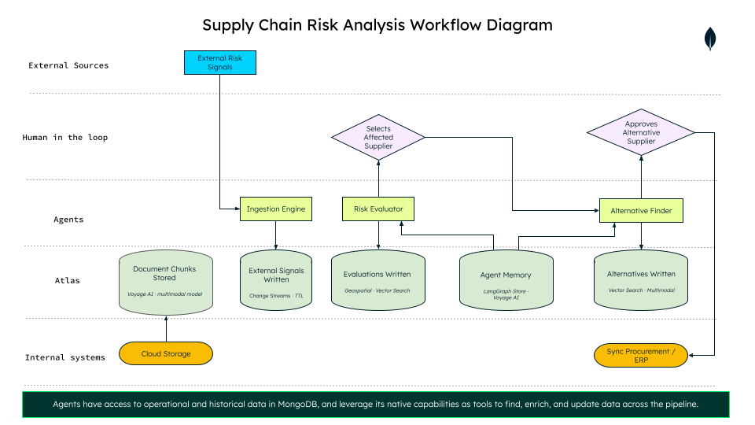

# Agentic Supplier Management – Real-Time Supply Chain Risk with AI Agents

This README helps developers understand the purpose, structure, and deployment process of this Demo App.

---

## Overview

This demo showcases **Agentic Supplier Management** — a working example of how retailers can detect supply chain disruptions in real time and surface alternative suppliers using AI agents, all built on MongoDB.

When an external signal is detected — a geopolitical tariff, a climate event, a logistics disruption — two LangGraph agents run in sequence: **risk_evaluator** evaluates supplier risk using dynamic [RPN scoring](https://en.wikipedia.org/wiki/Failure_mode_and_effects_analysis) and historical memory from Atlas Vector Search, then **alternative_finder** surfaces validated alternatives using in-database hybrid search and native reranking.

None of this is fast enough on a patchwork of legacy ERP tables, a separate vector database, and disconnected search tools stitched together with custom pipelines — a single geopolitical announcement or shipping bottleneck can change supplier costs overnight. This demo is a working, code-verified example of what MongoDB calls a [converged datastore](https://www.mongodb.com/company/blog/technical/converged-datastore-for-agentic-ai) for agentic AI: business entities, vector embeddings, and agent state all living together under one API, one query language, one security model.


---

## Discover in this Demo

- **Watch the agents work, not just their output**
  The UI streams every step live: which supplier the agent is looking at, which MongoDB operation it just ran — a vector search, a geospatial query, a rerank — and what it found. You see the agent's reasoning and the real data behind it side by side, not just a final answer.

- **`risk_evaluator` — real risk math over simulated signals**
  LangGraph + Claude. Detects the session's disruption signals (simulated for the demo, but structurally identical to a real feed), matches exposed suppliers with geospatial (`$geoWithin`) and region queries, scores dynamic RPN risk, and runs a ReAct loop that retrieves historical memory via Atlas Vector Search before writing a natural-language summary.

- **`alternative_finder` — every kind of search MongoDB can do, chained together**
  LangGraph. Narrows candidates with `$rankFusion` hybrid search (vector + full-text), reranks natively in-pipeline with `$rerank`, cross-checks each candidate against its own cited documents and historical precedent, then ranks survivors by `$geoNear` proximity. Human-in-the-loop: the final pick is always the procurement manager's call.

- **One dataset, every collection type in play**
  Suppliers, purchase orders, a risk catalog, supplier documents, and historical agent memory episodes all live in [`docs/database-files/`](./docs/database-files/) — so you can run the full demo end to end.

### MongoDB Atlas capabilities used in this demo

1. [`$vectorSearch`](https://www.mongodb.com/docs/atlas/atlas-vector-search/vector-search-overview/) — semantic search over `agent_memory` (risk precedent) and `supplier_documents` (certifications, contracts), with Atlas Auto-Embedding — no separate embedding pipeline to maintain.
2. [`$rankFusion`](https://www.mongodb.com/resources/products/capabilities/hybrid-search) — hybrid search in `alternative_finder`, combining vector similarity and full-text relevance into a single ranked result.
3. [Native `$rerank`](https://www.mongodb.com/docs/vector-search/hybrid-search/vector-search-with-full-text-search/) — Voyage's reranking model running as an aggregation stage inside Atlas; candidates are never pulled out to an external API to be reranked.
4. [`$search`](https://www.mongodb.com/docs/atlas/atlas-search/) — full-text search over `supplier_documents` chunks, the lexical half of the hybrid search.
5. [`$geoWithin` / `$centerSphere`](https://www.mongodb.com/docs/manual/geospatial-queries/) — geospatial matching in `risk_evaluator`, so a physical disruption (a storm, a port closure) only affects suppliers actually within its radius.
6. [`$geoNear`](https://www.mongodb.com/docs/manual/reference/operator/aggregation/geoNear/) — proximity ranking in `alternative_finder`, factoring distance-to-distribution-center into how alternative suppliers are ranked.
7. [Aggregation pipelines](https://www.mongodb.com/docs/manual/aggregation/) — used throughout for operational context (e.g. active purchase orders per supplier) alongside the search stages above.
8. [2dsphere index](https://www.mongodb.com/docs/manual/core/indexes/index-types/index-geospatial/) — powers the geospatial queries on `suppliers.location`.
9. [Compound indexes](https://www.mongodb.com/docs/manual/core/index-compound/) — e.g. `supplier_id + risk_type` on `agent_memory`, keeping precedent lookups fast as the collection grows.
10. **Session cleanup** — demo-session data in `external_conditions` needs periodic cleanup; either a [TTL index](https://www.mongodb.com/docs/manual/core/index-ttl/) or also an [Atlas Scheduled Trigger](https://www.mongodb.com/docs/atlas/atlas-ui/triggers/) can implement this.


---

## 🧩 Architecture Overview




| Component | Description |
|-----------|-------------|
| **Frontend (Next.js)** | Full-stack frontend that delivers the step-by-step demo UI, manages session isolation, and streams agent progress in real time. Includes an Atlas Charts dashboard for supply chain visualization. |
| **Backend (FastAPI)** | Cleanly architected as vertical slices — three logical services (`ingestion_engine`, `risk_evaluator`, `alternative_finder`) running as a single FastAPI app for demo simplicity. Slices never import from each other; they integrate only through shared MongoDB collections and the `session_id` / `evaluation_id` identifiers. |
| **`ingestion_engine`** | Not an agent — fully deterministic. Picks up to 3 suppliers with active orders, matches them to a base disruption signal, and calibrates a `condition_score` (reading `agent_memory` for a historical weighting factor) to guarantee at least one supplier reaches CRITICAL each session. |
| **`risk_evaluator`** | Real 5-node LangGraph `StateGraph` that detects disruption signals, matches affected suppliers, calculates dynamic RPN scores, runs a ReAct loop to retrieve historical memory, and generates a Claude-powered natural-language summary. |
| **`alternative_finder`** | Human-in-the-loop LangGraph `StateGraph` (4 conceptual layers across 6 nodes) that runs `$rankFusion` hybrid search + native `$rerank`, audits candidates against cited documents and precedent, and ranks them by `$geoNear` proximity and evidence. |
| **MongoDB Atlas** | The unified intelligence layer: stores `suppliers`, `purchase_orders`, `risk_catalog`, and `supplier_documents` (chunked + auto-embedded on write), plus `agent_memory` and the three session-scoped outputs — `external_conditions`, `supplier_risk_evaluations`, and `supplier_alternatives`. Atlas is also the search engine itself: Vector Search, Atlas Search, `$rankFusion`, and native `$rerank` run as pipeline stages in-database — no external vector DB, no separate embedding service, no data leaving Atlas. Same platform scales, secure and governed by default. |

👉 For technical deep dives:
- [Frontend README](./frontend/README.md)
- [Backend README](./backend/README.md) — architecture, data model, SSE contracts
- [`ingestion_engine` README](./backend/ingestion_engine/README.md)
- [`risk_evaluator` README](./backend/risk_evaluator/README.md)
- [`alternative_finder` README](./backend/alternative_finder/README.md)
- [Architecture Decision Records](./docs/adr/) — the reasoning behind each design choice. You can also learn about the good practices and patterns related to this demo as a PoC.
- [Dataset & seed setup](./docs/database-files/) — sample data to populate your own Atlas cluster for this demo, with a guide to unlock advanced features like auto-embed and native rerank

---

## 🗂 Folder Structure

```bash
retail-supply-chain-management/
├── frontend/               # Next.js app
├── backend/                # FastAPI backend (vertical slice architecture)
├── docs/
│   ├── adr/                # Architecture Decision Records (backend-tagged; frontend series to follow)
│   ├── database-files/     # Seed data (suppliers, orders, risk catalog, agent memory) + setup guide
│   └── images/              # Diagrams used in this README
├── docker-compose.yml      # Orchestrates services
└── makefile                # Dev commands
```

---

## 🐳 Getting Started – Run the Full Demo Locally

### 🔧 Prerequisites

- [MongoDB Atlas account](https://www.mongodb.com/cloud/atlas/register) (M10 or higher for Vector Search)
- Anthropic API key — used by `risk_evaluator` and `alternative_finder` for their LLM calls (risk summaries, planning, auditing, rationales)
- Voyage AI API key — used by Atlas for `agent_memory` / `supplier_documents` auto-embedding and the native `$rerank` stage in `alternative_finder`
- [Atlas Charts](https://www.mongodb.com/products/charts) dashboard configured with your cluster
- Sample data loaded into your cluster — see [`docs/database-files/`](./docs/database-files/) for the seed files (suppliers, purchase orders, risk catalog, supplier documents, and historical `agent_memory` episodes)
- Environment configuration files (`.env`) for each service, using the example files as a template:
  - [frontend](./frontend/EXAMPLE.env)
  - [backend](./backend/.env.example)
- Installed tools:
  - Docker + Docker Compose
  - Node.js 22 or higher (if running the frontend separately)
  - Python 3.13 + uv (if running the backend separately — [uv install guide](https://docs.astral.sh/uv/getting-started/installation/))

---

### 🚀 Start Locally with Docker Compose

```bash
git clone https://github.com/mongodb-industry-solutions/retail-supply-chain-management.git
cd retail-supply-chain-management
make build
```

> 📝 **Note:** Once running, go to [http://localhost:3000](http://localhost:3000) for the frontend and [http://localhost:8000/docs](http://localhost:8000/docs) for the backend API docs.

#### Common Commands

| Action                  | Command      |
|-------------------------|--------------|
| Build & start           | `make build` |
| Start (no rebuild)      | `make start` |
| Stop all containers     | `make stop`  |
| Clean containers/images | `make clean` |

---

## 👨‍💻 Explore the Demo

The demo is structured as a step-by-step procurement workflow:

1. **Dashboard** — Atlas Charts visualization of your supply chain data
2. **Start simulation** — ingest disruption signals (geopolitical, climate, logistics)
3. **Evaluate risk** — `risk_evaluator` scores all suppliers and streams its reasoning live
4. **Act on flagged suppliers** — `alternative_finder` finds and validates alternatives on demand

Each session is fully isolated by a `session_id` generated in the browser — no state leaks between runs.

---

## 🍃 Why MongoDB for Agentic Supply Chain Management

Agentic AI workloads break assumptions most data platforms were never built for. MongoDB frames it as an industry-wide shift: databases went from [systems of record, to systems of engagement, and agentic AI is now pushing them toward systems of action](https://www.mongodb.com/resources/industries/database-digest-2026-edition/unified-intelligence-layer) — agents that execute and decide, not just retrieve. That shift multiplies complexity: an agent reasons in a loop, hitting vector search, full-text search, and geospatial queries dozens of times a session, against data that has to evolve as fast as the business does. MongoDB's advantage for this new class of workload comes down to five things:

### 1. One consolidated data platform
Agentic systems need operational data, vector embeddings, full-text search, and reranking to all be queryable together — an agent reasoning across a disruption doesn't have time to round-trip between four different systems to assemble context. MongoDB is the only platform that unifies all of it — database, vector store, search engine, and reranker — in one place, queried through a [single aggregation pipeline](https://www.mongodb.com/company/blog/technical/converged-datastore-for-agentic-ai). This demo's `alternative_finder` proves it end to end: [`$rankFusion`](https://www.mongodb.com/company/blog/technical/harness-power-atlas-search-vector-search-with-rankfusion) and [native `$rerank`](https://www.mongodb.com/products/updates/) run as stages in the same pipeline, no data ever leaves Atlas.

### 2. Architecturally built for AI
Agentic workloads deal with messy, evolving, real-world entities — suppliers, contracts, incidents — that don't fit a fixed relational shape and never stop changing. A [flexible, document-native schema](https://www.mongodb.com/company/blog/technical/from-prompt-production-mongodb-atlas-agentic-dev) lets that data evolve at the pace of the business, not the pace of a migration.

### 3. Trustworthy, secure, and governed by default
An autonomous agent making decisions over sensitive operational data raises the stakes on security, not just the convenience. Nothing about agentic AI matters if the platform underneath it can't be trusted — [encryption, access control, and governance need to be defaults built into the platform](https://www.mongodb.com/products/capabilities/security), not something bolted on after an agent is already querying live data.


### 4. Build once, run anywhere
As agentic workloads scale, hyperscaler capacity itself is becoming a real constraint — not just a preference. An agentic platform locked to a single cloud provider doesn't scale with the business if that provider runs short on capacity. Being [multi-cloud in MongoDB](https://www.mongodb.com/company/newsroom/press-releases/mongodb-delivers-accurate-ai-retrieval-wherever-enterprise-data-lives) means the same document model and query API run unchanged across AWS, Azure, GCP, and on-prem — that constraint never becomes the application's problem. That's what build once, run anywhere actually means in practice.

### 5. Control context, control costs
As agents get more capable, token spend becomes a real budget line, not a rounding error — [multi-agent systems can burn up to 15x more tokens than a single chat conversation](https://www.mongodb.com/company/blog/technical/why-multi-agent-systems-need-memory-engineering), and that cost compounds with every redundant retrieval and every irrelevant detail dragged into a prompt. The only way to control it is by controlling context: [being the data layer that stores and retrieves agent memory](https://www.mongodb.com/resources/basics/artificial-intelligence/database-role-agent-memory) lets MongoDB return exactly what an agent needs, precisely when it needs it — cutting the token overhead that comes from re-fetching, over-fetching, or re-summarizing the same context across sessions.

---

## 👥 Authors

### Lead Authors *(Use Case Ideation & Retail Implementation)*

- [**Ronan Conlon**](https://www.linkedin.com/in/ronan-conlon/) – Principal. Retail CTO

### Developers & Maintainers *(Technical Design & Implementation)*

- [**Florencia Arin**](https://www.linkedin.com/in/floarin/) – Developer & Maintainer
- [**Angie Guemes**](https://www.linkedin.com/in/angelica-guemes-estrada/) – Developer & Maintainer

---

## MIT License

Copyright (c) 2025 MongoDB

Permission is hereby granted, free of charge, to any person obtaining a copy of this software and associated documentation files (the "Software"), to deal in the Software without restriction, including without limitation the rights to use, copy, modify, merge, publish, distribute, sublicense, and/or sell copies of the Software, and to permit persons to whom the Software is furnished to do so, subject to the following conditions:

The above copyright notice and this permission notice shall be included in all copies or substantial portions of the Software.

THE SOFTWARE IS PROVIDED "AS IS", WITHOUT WARRANTY OF ANY KIND, EXPRESS OR IMPLIED, INCLUDING BUT NOT LIMITED TO THE WARRANTIES OF MERCHANTABILITY, FITNESS FOR A PARTICULAR PURPOSE AND NONINFRINGEMENT. IN NO EVENT SHALL THE AUTHORS OR COPYRIGHT HOLDERS BE LIABLE FOR ANY CLAIM, DAMAGES OR OTHER LIABILITY, WHETHER IN AN ACTION OF CONTRACT, TORT OR OTHERWISE, ARISING FROM, OUT OF OR IN CONNECTION WITH THE SOFTWARE OR THE USE OR OTHER DEALINGS IN THE SOFTWARE.
