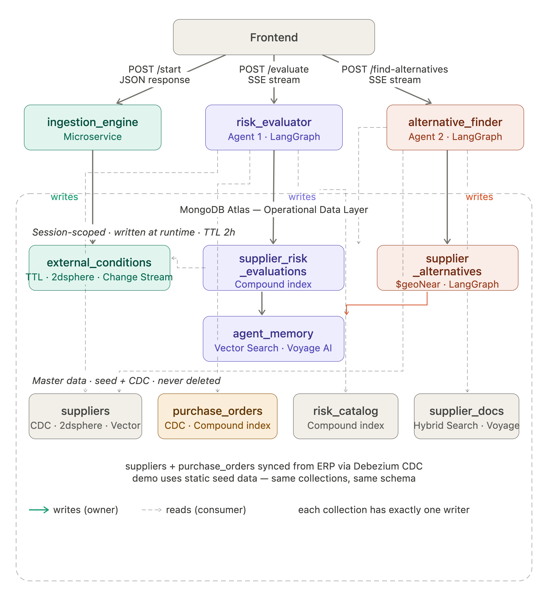

# Retail Supply Chain Risk — Backend

FastAPI backend for the Retail Supply Chain Risk demo. Simulates external disruption signals, evaluates supplier risk in real time using a LangGraph agent, and surfaces alternative suppliers through a second agentic flow — both agents stream progress to the frontend via Server-Sent Events. MongoDB Atlas is the operational database, vector search index, and LangGraph state checkpointer.

---

## Architecture

The backend is organised as **vertical slices** — three logical services that would be independent microservices in production, running as a single FastAPI app for demo simplicity. Slices never import from each other. Each service owns its collections in MongoDB — the only way services share data is by reading each other's collections, never by calling each other directly. This is the Operational Data Layer pattern documented in [ADR 005](./adrs/005-operational-data-layer.md).



```
Frontend
   │
   ├─ POST /api/simulation/start        → ingestion_engine   (JSON response)
   ├─ POST /api/simulation/evaluate     → risk_evaluator     (SSE stream)
   └─ POST /api/agent/find-alternatives → alternative_finder (SSE stream)
```

---

## The Three Slices

### `ingestion_engine` — Signal Ingestion

Accepts `POST /api/simulation/start`. Generates 3 demo trigger documents — one per risk type (geopolitical, climate, logistics) — and inserts them into `external_conditions`. Returns all 3 inserted documents as a JSON response.

Signal content varies per session to produce different affected suppliers across demo runs. Which suppliers enter alert or critical state is determined entirely by the signal content (affected regions, epicentre coordinates, impact radius) — no supplier is hardcoded.

**Endpoint:** `POST /api/simulation/start`
**Response:** `{ session_id, signals: [{...}, {...}, {...}] }`

---

### `risk_evaluator` — Agent 1, RPN Risk Evaluation

Activated by an explicit `POST /api/simulation/evaluate` from the frontend after ingestion completes. Runs a LangGraph graph that detects active conditions, matches affected suppliers, calculates dynamic RPN scores, retrieves historical memory, and generates a natural-language risk summary via Claude.

Streams agent progress to the frontend via SSE as each node executes.

**Endpoint:** `POST /api/simulation/evaluate`
**Response:** SSE stream → `tool_start` / `tool_end` / `agent_response` / `error` events

> **Production note:** In a production system this agent would be activated by a MongoDB Change Stream watching `external_conditions` for `is_demo_trigger: true` inserts — eliminating the explicit frontend call. The Change Stream activation pattern is documented in `stream_listener.py` and ADR 003 as an educational reference.

---

### `alternative_finder` — Agent 2, Alternative Supplier Search

Human-in-the-loop. Activated by an explicit `POST /api/agent/find-alternatives` when the procurement manager decides to act on a flagged supplier. Runs a LangGraph graph that performs Atlas hybrid search, Voyage AI reranking, and three validation filters (certifications, lead time, capacity).

Streams agent progress to the frontend via SSE as each node executes.

**Endpoint:** `POST /api/agent/find-alternatives`
**Response:** SSE stream → `tool_start` / `tool_end` / `agent_response` / `error` events

---

## Folder Structure

```
backend/
├── main.py                  FastAPI app bootstrap, middleware, router registration, lifespan
├── pyproject.toml           Dependencies and build config (managed with uv)
├── .env.example             Required environment variables (never commit .env)
├── architecture.png         Architecture diagram — ODL pattern and slice boundaries
│
├── core/                    Shared infrastructure — imported by slices, never the reverse
│   ├── config.py            Pydantic-settings Settings class and get_settings() singleton
│   ├── db.py                Motor AsyncIOMotorClient singleton (connect / disconnect / get_database)
│   ├── session.py           FastAPI dependency — validates and extracts X-Session-ID header
│   └── exceptions.py        Custom exceptions: SessionNotFoundError, SignalGenerationError, EvaluationError
│
├── ingestion_engine/        Slice 1 — demo signal ingestion
│   ├── router.py            POST /api/simulation/start → JSON response
│   ├── service.py           Orchestrates target selection, signal generation, and MongoDB insert
│   ├── signal_generator.py  Builds 3 demo trigger documents (one per risk type)
│   └── target_selector.py   Shuffles active-order suppliers, matches risk_catalog by region, picks up to 3 pairs (one per risk type)
│
├── risk_evaluator/          Slice 2 — LangGraph RPN risk evaluation (Agent 1)
│   ├── router.py            POST /api/simulation/evaluate → SSE stream
│   ├── graph.py             LangGraph StateGraph definition
│   ├── nodes.py             detect_conditions → match_suppliers → calculate_rpn → retrieve_memory → generate_summary
│   ├── schemas.py           RiskEvaluatorState, RiskScore, EvaluationResult
│   └── stream_listener.py   Production reference only — Change Stream activation pattern (not used in demo)
│
├── alternative_finder/      Slice 3 — LangGraph alternative supplier search (Agent 2)
│   ├── router.py            POST /api/agent/find-alternatives → SSE stream
│   ├── graph.py             LangGraph StateGraph definition
│   ├── nodes.py             hybrid_search → voyage_rerank → validate_certifications → validate_lead_time → validate_capacity
│   └── schemas.py           AlternativeFinderState, Candidate, AlternativeFinderResult
│
├── voyageai/                Thin wrapper around MongoDB-native Voyage AI reranker
│   └── rerank.py            rerank(query, documents, top_k) — executes inside Atlas aggregation pipeline
│
├── docs/
│   └── seeds/               Seed files and Atlas setup guide
│       ├── README.md        Step-by-step cluster setup, indexes, and replication guide
│       ├── suppliers_seed.json
│       ├── risk_catalog_seed.json
│       ├── purchase_orders_seed.json
│       ├── supplier_documents_seed.json
│       └── external_conditions_seed.json
│
└── adrs/                    Architecture Decision Records
    ├── 001-architecture-overview.md
    ├── 002-async-motor.md
    ├── 003-sse-change-stream.md
    ├── 004-langgraph-checkpointing.md
    └── 005-operational-data-layer.md
```

---

## Session Model

Every demo run is isolated by a `session_id`. The frontend generates it with `crypto.randomUUID()` on "Start Simulation" click and sends it on every request via the `X-Session-ID` header. The backend never generates or transforms it — it receives, validates (non-empty), and uses it to scope all MongoDB reads and writes.

```
X-Session-ID: sess-abc123
```

| Collection | Session-scoped | Written by | TTL |
|---|---|---|---|
| `external_conditions` | ✅ | ingestion_engine | TBD |
| `supplier_risk_evaluations` | ✅ | Agent 1 | TBD |
| `supplier_alternatives` | ✅ | Agent 2 | TBD |
| `agent_memory` | ✅ | Agent 1 + 2 | TBD |
| `suppliers` | ❌ | Seed data | — |
| `risk_catalog` | ❌ | Seed data | — |
| `purchase_orders` | ❌ | Seed data | — |
| `supplier_documents` | ❌ | Seed data | — |

LangGraph checkpointing uses `thread_id = session_id` — both agents are automatically session-isolated.

Demo cleanup runs via Atlas Scheduled Trigger daily at 00:00 UTC (`deleteMany({ is_base: false, session_id: ... })`). TTL strategy to be defined at end of demo development — all session-scoped documents currently use `valid_until: null`.

---

## SSE Event Structure

Both Agent 1 and Agent 2 use the same event pattern.

```
data: {"type": "tool_start", "message": "Detecting external conditions..."}
data: {"type": "tool_end",   "message": "Detecting external conditions..."}
data: {"type": "agent_response", "data": { ... }}
data: {"type": "error", "message": "..."}
```

| Field | Type | Description |
|---|---|---|
| `type` | string | `tool_start` \| `tool_end` \| `agent_response` \| `error` |
| `message` | string | Human-readable step label shown in the UI |
| `data` | object | Final payload — only present on `agent_response` |
| `phase` | string | `left` \| `right` — Agent 2 only, for two-column UI layout |

---

## Running Locally

```bash
# Install dependencies
uv sync

# Copy and fill in environment variables
cp .env.example .env
# Edit .env with your MongoDB URI and API keys

# Start the server
uv run uvicorn main:app --reload
```

API available at `http://localhost:8000`. Health check: `GET /`.

---

## Environment Variables

| Variable | Description |
|---|---|
| `MONGODB_URI` | MongoDB Atlas connection string |
| `DATABASE_NAME` | Target database (default: `retail-supply-chain-risk`) |
| `APP_NAME` | App name tag shown in Atlas (default: `retail-supply-chain-risk`) |
| `ANTHROPIC_API_KEY` | Anthropic API key — used by `generate_summary` node in Agent 1 |
| `VOYAGE_API_KEY` | Voyage AI API key — used by `voyage_rerank` node in Agent 2 |
| `CORS_ORIGINS` | Allowed origins (default: `["*"]` — restrict before production) |

---

## Architecture Decision Records

- [001 — Vertical Slice Architecture](./adrs/001-architecture-overview.md)
- [002 — Motor Async Driver](./adrs/002-async-motor.md)
- [003 — SSE + Change Streams](./adrs/003-sse-change-stream.md) — includes production vs demo activation model
- [004 — LangGraph Checkpointing](./adrs/004-langgraph-checkpointing.md)
- [005 — Operational Data Layer](./adrs/005-operational-data-layer.md)

---

## API Contract

Every request sends `X-Session-ID` in the header. The backend never generates or modifies the session — it uses it exclusively to scope MongoDB reads and writes.

```
X-Session-ID: <session_id>    # required on every request
```

---

### Step 1 — `POST /api/simulation/start`

Triggers signal ingestion. No request body needed — the backend generates the 3 signals internally. Returns immediately with the 3 inserted documents.

The ingestion engine is the demo's setup mechanism — its only job is to plant the right data in MongoDB so the agents have something real to reason about. In a production environment this role would be filled by real external feeds: GDELT for geopolitical signals, MarineTraffic for port disruptions, NOAA for climate events. The agents never know whether a signal came from a real feed or from the ingestion engine — the document structure is identical.

**Request**
```
POST /api/simulation/start
X-Session-ID: sess-abc123
```

**Response** `200 OK`
```json
{
  "session_id": "sess-abc123",
  "signals": [
    {
      "condition_id": "COND-sess-abc1-GEO",
      "risk_catalog_ref": "RISK-GEO-001",
      "risk_type_triggered": "geopolitical_tariff",
      "source": "GDELT",
      "raw_headline": "US announces 25% tariffs on CN packaging imports — effective in 15 days",
      "affected_regions": ["CN", "TW"],
      "condition_score": 0.87,
      "has_physical_location": false,
      "detected_at": "2026-06-18T14:00:00Z",
      "valid_until": null,
      "is_base": false,
      "is_demo_trigger": true,
      "session_id": "sess-abc123"
    },
    {
      "condition_id": "COND-sess-abc1-LOG",
      "risk_catalog_ref": "RISK-LOG-001",
      "risk_type_triggered": "logistics_disruption",
      "source": "MarineTraffic",
      "raw_headline": "Severe port congestion at Yantian/Shenzhen — vessel queuing 48–72h delays",
      "affected_regions": ["CN", "HK"],
      "condition_score": 0.76,
      "has_physical_location": true,
      "epicentre": { "type": "Point", "coordinates": [114.1095, 22.5229] },
      "impact_radius_km": 80,
      "detected_at": "2026-06-18T14:00:00Z",
      "valid_until": null,
      "is_base": false,
      "is_demo_trigger": true,
      "session_id": "sess-abc123"
    },
    {
      "condition_id": "COND-sess-abc1-CLM",
      "risk_catalog_ref": "RISK-CLM-001",
      "risk_type_triggered": "climate_disruption",
      "source": "NOAA",
      "raw_headline": "Tropical storm advisory — Oaxaca Pacific coast, Category 1 landfall 72h",
      "affected_regions": ["MX"],
      "condition_score": 0.82,
      "has_physical_location": true,
      "epicentre": { "type": "Point", "coordinates": [-96.7266, 17.0732] },
      "impact_radius_km": 120,
      "detected_at": "2026-06-18T14:00:00Z",
      "valid_until": null,
      "is_base": false,
      "is_demo_trigger": true,
      "session_id": "sess-abc123"
    }
  ]
}
```

**Error**
```json
{ "detail": "Signal generation failed" }
```

---

### Step 2 — `POST /api/simulation/evaluate`

Activates Agent 1 (risk_evaluator). Reads the session's signals from `external_conditions`, evaluates all 40 suppliers, and streams progress as each LangGraph node executes. The final `agent_response` event carries the full evaluation result.

**Request**
```
POST /api/simulation/evaluate
X-Session-ID: sess-abc123
```

**SSE stream**
```
data: {"type": "tool_start", "message": "Detecting external conditions..."}
data: {"type": "tool_end",   "message": "Detecting external conditions..."}
data: {"type": "tool_start", "message": "Matching affected suppliers..."}
data: {"type": "tool_end",   "message": "Matching affected suppliers..."}
data: {"type": "tool_start", "message": "Calculating dynamic RPN scores..."}
data: {"type": "tool_end",   "message": "Calculating dynamic RPN scores..."}
data: {"type": "tool_start", "message": "Retrieving historical memory..."}
data: {"type": "tool_end",   "message": "Retrieving historical memory..."}
data: {"type": "tool_start", "message": "Generating risk summary..."}
data: {"type": "tool_end",   "message": "Generating risk summary..."}
data: {"type": "agent_response", "data": { ... }}
```

**`agent_response` payload**
```json
{
  "type": "agent_response",
  "data": {
    "session_id": "sess-abc123",
    "conditions": [
      {
        "condition_id": "COND-sess-abc1-GEO",
        "source": "GDELT",
        "raw_headline": "US announces 25% tariffs on CN packaging imports — effective in 15 days",
        "risk_type_triggered": "geopolitical_tariff",
        "affected_regions": ["CN", "TW"],
        "condition_score": 0.87,
        "has_physical_location": false
      }
    ],
    "suppliers": [
      {
        "supplier_id": "SUP-SHENZHEN-441",
        "supplier_name": "Shenzhen Advanced Materials Co.",
        "region": "CN",
        "country": "China",
        "product_categories": ["packaging_materials"],
        "supplier_risk_level": "CRITICAL",
        "requires_action": true,
        "operational_context": {
          "active_orders": 3,
          "total_value_usd": 2400000,
          "earliest_delivery_due": "2026-07-10",
          "days_until_due": 22,
          "criticality": "high"
        },
        "risk_scores": [
          {
            "risk_id": "RISK-GEO-001",
            "condition_id": "COND-sess-abc1-GEO",
            "rpn_base": 160,
            "rpn_dynamic": 278,
            "rpn_status": "CRITICAL",
            "triggered_by": {
              "source": "GDELT",
              "condition_score": 0.87,
              "historical_weight": 1.20
            }
          }
        ],
        "natural_language_summary": "SUP-SHENZHEN-441 is at CRITICAL risk. The newly announced US-CN tariffs directly impact packaging imports with an RPN of 278, well above the alert threshold of 260. Three active orders totalling $2.4M are due within 22 days. Historical memory confirms a prior tariff escalation in Q1 2025 resulted in 18-day delays and $340K cost overrun. Immediate alternative sourcing is recommended.",
        "session_id": "sess-abc123"
      }
    ]
  }
}
```

**Error**
```
data: {"type": "error", "message": "Failed to calculate RPN scores"}
```

---

### Step 3 — `POST /api/agent/find-alternatives`

Activates Agent 2 (alternative_finder). Human-in-the-loop — called when the procurement manager decides to act on a flagged supplier. Reads evaluation context from `supplier_risk_evaluations` by session and supplier, runs hybrid search + Voyage AI reranking + validation filters, and streams progress.

**Request**
```
POST /api/agent/find-alternatives
X-Session-ID: sess-abc123
Content-Type: application/json

{
  "supplier_id": "SUP-SHENZHEN-441"
}
```

**SSE stream**
```
data: {"type": "tool_start", "phase": "left",  "message": "Hybrid Search: retrieving top 13 candidates"}
data: {"type": "tool_end",   "phase": "left",  "message": "Hybrid Search: retrieving top 13 candidates"}
data: {"type": "tool_start", "phase": "left",  "message": "Voyage Rerank: refine to top 5"}
data: {"type": "tool_end",   "phase": "left",  "message": "Voyage Rerank: refine to top 5"}
data: {"type": "tool_start", "phase": "right", "message": "Validating certifications"}
data: {"type": "tool_end",   "phase": "right", "message": "Validating certifications"}
data: {"type": "tool_start", "phase": "right", "message": "Validating lead time"}
data: {"type": "tool_end",   "phase": "right", "message": "Validating lead time"}
data: {"type": "tool_start", "phase": "right", "message": "Validating capacity"}
data: {"type": "tool_end",   "phase": "right", "message": "Validating capacity"}
data: {"type": "agent_response", "data": [ ... ]}
```

**`agent_response` payload**
```json
{
  "type": "agent_response",
  "data": [
    {
      "supplier_id": "SUP-GUADALAJARA-MX",
      "rank": 1,
      "supplier_name": "Guadalajara Packaging Co.",
      "region": "MX",
      "country": "Mexico",
      "product_categories": ["packaging_materials"],
      "rrf_score": 0.0312,
      "certifications": ["ISO 9001", "ISO 14001"],
      "avg_lead_time_days": 18,
      "committed_capacity_pct": 0.45,
      "proximity_km": 2810,
      "proximity_note": "MX-Guadalajara → LA DC · est. 4-day transit · within delivery window",
      "validation": {
        "certifications_pass": true,
        "lead_time_pass": true,
        "capacity_pass": true
      },
      "evidence": [
        "ISO 9001:2015 valid until Dec 2027 — scope includes packaging materials",
        "Framework contract active · urgent delivery clause confirmed",
        "Sustainability audit completed March 2025 · ISO 14064-1 verified"
      ],
      "gaps": ["Lead time avg 18 days · delivery window is 22 days · 4-day buffer"],
      "session_id": "sess-abc123"
    }
  ]
}
```

**Error**
```
data: {"type": "error", "message": "Vector search failed: index not found"}
```

---

## Frontend

Maintained separately. See [`/frontend`](../frontend/).
