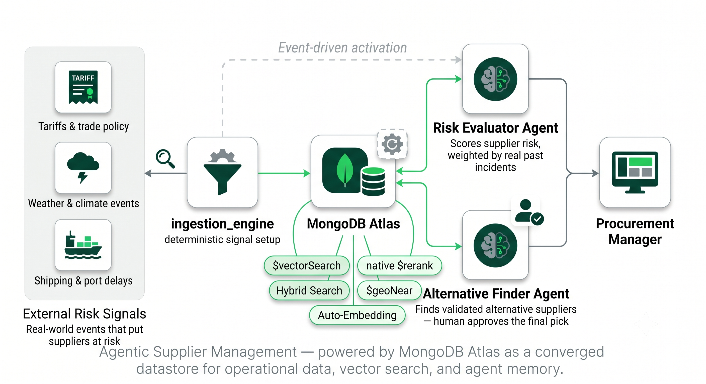

# Retail Supply Chain Risk — Backend

FastAPI backend for the Retail Supply Chain Risk demo. It ingests demo
disruption signals, evaluates supplier exposure with a LangGraph agent, and
surfaces validated alternative suppliers with a second LangGraph agent — both
agents stream their reasoning to the frontend via Server-Sent Events. MongoDB
Atlas is the unified intelligence layer.

Per-module detail lives in each slice's README:
[`ingestion_engine`](./ingestion_engine/README.md) ·
[`risk_evaluator`](./risk_evaluator/README.md) ·
[`alternative_finder`](./alternative_finder/README.md).

---

## What this system does

A procurement manager sources from 40+ suppliers across 18 countries. When the
world changes — a tariff announcement, a port closure, a tropical storm — they
need to know quickly which suppliers are exposed, how seriously, and what orders
are at risk. This system monitors external signals, calculates a dynamic risk
score per supplier (the RPN — Risk Priority Number), and when a supplier crosses
the critical threshold it can pre-populate a shortlist of alternatives for the
manager to review and approve.



**Core principle: the system informs, it does not act.** `alternative_finder`
always leaves `approved_supplier_id: null` — no downstream/ERP action fires
without an explicit human approval that the agents never perform.


---

## Architecture: vertical slices, integrated only through MongoDB

The backend is organised as **vertical slices** — three logical services that
would be independent microservices in production, running as one FastAPI app
for demo simplicity. **No slice imports from another slice.** They integrate
purely through shared MongoDB collections plus two identifiers that flow through
the request path — `session_id` and `evaluation_id`. This is the Operational
Data Layer pattern of [ADR-005](../docs/adr/005-backend-operational-data-layer.md).

```
Frontend
   │
   ├─ POST /api/simulation/start        → ingestion_engine   (JSON response)
   ├─ POST /api/simulation/evaluate     → risk_evaluator     (SSE stream)
   └─ POST /api/alternative-finder/find → alternative_finder (SSE stream)
```


The couplings are entirely by data + identifier:

- **`ingestion_engine` → `risk_evaluator`** via `external_conditions`:
  ingestion tags each generated signal with `is_demo_trigger: true` and the
  `session_id`; `risk_evaluator.detect_conditions` filters on exactly that pair.
- **`risk_evaluator` → `alternative_finder`** via `supplier_risk_evaluations`:
  `risk_evaluator` writes a document with an `evaluation_id`; the frontend hands
  that id back as the `evaluation_id_ref` body field on the
  `/api/alternative-finder/find` call, and `alternative_finder.plan_node` reads
  the document by it.

No module calls another module's function or HTTP endpoint.

---

## The three slices (summary)

| Slice | Kind | Endpoint | Writes |
|-------|------|----------|--------|
| `ingestion_engine` | **Not an agent** — deterministic, no LLM, no graph | `POST /api/simulation/start` (JSON) | `external_conditions` |
| `risk_evaluator` | Real 5-node LangGraph `StateGraph`; one shared inner ReAct loop (LLM) | `POST /api/simulation/evaluate` (SSE) | `supplier_risk_evaluations` |
| `alternative_finder` | Real 6-node LangGraph `StateGraph` (4 conceptual layers); LLM in 3 nodes | `POST /api/alternative-finder/find` (SSE) | `supplier_alternatives` |

See each module README for the node sequences, the exact filters/queries, the
MongoDB capabilities used (`$geoWithin`, `$vectorSearch`, `$rankFusion`, native
`$rerank`, `$geoNear`, aggregations), the ReAct parsing/fallback behavior, the
real SSE event types, and the confirmed dead code (`risk_evaluator`'s
`retrieve_memory`). Note that `$rerank` runs natively in-pipeline inside
`alternative_finder` — no external Voyage API call is made at runtime ([ADR-007](../docs/adr/007-backend-native_reranking.md)).

---


## Folder structure

```
backend/
├── main.py                  FastAPI app bootstrap, middleware, router registration, lifespan
├── pyproject.toml           Dependencies and build config (managed with uv)
├── .env.example             Required environment variables (never commit .env)
│
├── core/                    Shared infrastructure — imported by slices, never the reverse
│   ├── config.py            pydantic-settings Settings + get_settings() singleton
│   ├── db.py                Motor AsyncIOMotorClient singleton (connect / disconnect / get_database)
│   ├── session.py           FastAPI dependency — validates X-Session-ID header (400 if missing/empty)
│   ├── exceptions.py        SessionNotFoundError, SignalGenerationError, EvaluationError
│   ├── json_utils.py        _extract_json — shared LLM-JSON parser (regex + json.loads)
│   └── glossary.py          Shared plain-English term definitions surfaced in summaries/rationales
│
├── ingestion_engine/        Demo signal ingestion — deterministic, no agent
│   ├── router.py            POST /api/simulation/start → JSON response
│   ├── service.py           Orchestrates target selection + signal generation + insert
│   ├── target_selector.py   Shuffles active-order suppliers, matches risk_catalog by region
│   └── signal_generator.py  Builds/inserts demo trigger docs; reads agent_memory for the calibration weight
│
├── risk_evaluator/          LangGraph RPN risk evaluation (5 nodes)
│   ├── router.py            POST /api/simulation/evaluate → SSE stream
│   ├── graph.py             StateGraph, compiled WITHOUT a checkpointer
│   ├── nodes.py             detect_conditions → match_suppliers → calculate_rpn → reason_and_retrieve → generate_summary  (+ retrieve_memory: dead code)
│   ├── schemas.py           RiskEvaluatorState (TypedDict) + Pydantic output models
│   └── stream_listener.py   STUB (pass) — Change Stream activation reference, not used
│
├── alternative_finder/      LangGraph alternative supplier search (6 nodes / 4 layers)
│   ├── router.py            POST /api/alternative-finder/find → SSE stream
│   ├── graph.py             StateGraph, compiled WITHOUT a checkpointer
│   ├── nodes.py             plan_node → funnel_node → reflect_critique_node → rank_assembly_node → summarize_node → persist_node
│   └── schemas.py           AlternativeFinderState (TypedDict)
```

Architecture Decision Records live outside this folder, in [`docs/adr/`](../docs/adr/) — see the [ADR index](#architecture-decision-records) below. The seed files and their setup guide also live outside this folder, in [`docs/database-files/`](../docs/database-files/).

---

## Data model overview

Eight MongoDB collections in two groups.

**Fixed seed data** — never written by the modules, never deleted on reset:

| Collection | Purpose |
|---|---|
| `suppliers` | Master supplier register. Polymorphic docs; GeoJSON `location` powers geo queries. |
| `risk_catalog` | FMEA scores per risk type (severity, occurrence, detection, thresholds). |
| `purchase_orders` | Active orders — the financial/timing context behind a risk score. |
| `supplier_documents` | Document chunks (contracts, certificates, audits, etc.). Vector + full-text indexes power `alternative_finder`'s hybrid search. |
| `agent_memory` | Historical risk episodes, **seed-only**. Read-only for all modules (`risk_evaluator` and `alternative_finder` via `$vectorSearch`/`find`; `ingestion_engine` via a deterministic `find`). No module writes it — see *Memory closure loop* above. |

**Session-scoped data** — the three module writes:

| Collection | Written by | Purpose |
|---|---|---|
| `external_conditions` | `ingestion_engine` | Active risk signals. Base signals plus demo triggers (`is_demo_trigger: true`, calibrated `condition_score`). |
| `supplier_risk_evaluations` | `risk_evaluator` | One doc per non-OK supplier per session: dynamic RPN, triggering signals, operational context, LLM summary. Carries `evaluation_id`. |
| `supplier_alternatives` | `alternative_finder` | The ranked shortlist, `approved_supplier_id: null` until a human approves. |

> **Setup required:** See [`../docs/database-files/`](../docs/database-files/) for setup.

---

## Session model

Every run is isolated by a `session_id` the frontend generates and sends on
every request via the `X-Session-ID` header. The backend never generates or
transforms it — it uses it only to scope MongoDB reads/writes.

```
X-Session-ID: sess-abc123
```

> **Note:** there is **no LangGraph checkpointer** wired in. Both graphs compile
> without one and run in-memory per request; isolation comes from the fresh
> per-request state plus `session_id` document filtering, not from
> `thread_id`-namespaced checkpoints. See
> [ADR-004](../docs/adr/004-backend-langgraph-checkpointing.md).

---

## SSE: the two contracts differ

The two agents do **not** share one event schema:

- `risk_evaluator` frames each event on a **`type`** key: `tool_start`,
  `tool_end`, `atlas_operation`, `agent_thought`, `agent_response`, `error`,
  then a `None` sentinel to close.
- `alternative_finder` frames each event on an **`event`** key inside a common
  envelope (`event`, `layer`, `timestamp`, `session_id`):
  `alternative_finder_started`, `layer_started`/`layer_completed`,
  `atlas_operation`, `agent_thought`, `candidate_generated`/`candidate_audited`,
  `tool_start`/`tool_end`, `shortlist_ready`, `error`, `stream_end`, then a
  `None` sentinel.

There is no LLM token-level streaming, and no `phase` field. See each module
README for the full contract.


---

## Running locally

### Prerequisites
- Python 3.13+
- [uv](https://docs.astral.sh/uv/getting-started/installation/) — `curl -LsSf https://astral.sh/uv/install.sh | sh`
- A MongoDB Atlas cluster with the seed data and indexes loaded (see [`../docs/database-files/`](../docs/database-files/))

### Setup
```bash
cd backend
uv sync
cp .env.example .env      # then edit with your credentials
uv run uvicorn main:app --reload
```

API at `http://localhost:8000`. Health check: `GET /`.

---

## Environment variables

| Variable | Description |
|---|---|
| `MONGODB_URI` | MongoDB Atlas connection string |
| `DATABASE_NAME` | Target database (default: `retail-supply-chain-risk`) |
| `APP_NAME` | App name tag shown in Atlas (default: `retail-supply-chain-risk`) |
| `LLM_API_KEY` | API key for the LLM gateway |
| `LLM_BASE_URL` | Base URL for the LLM endpoint (direct Anthropic or your gateway) |
| `ANTHROPIC_MODEL` | Claude model name |
| `CORS_ORIGINS` | Allowed origins (default: `["*"]` — restrict before production) |

---

## API contract

Every request sends `X-Session-ID` (HTTP 400 if missing/empty). Call the
endpoints in order — each reads what the previous one wrote.

### `POST /api/simulation/start`
No body. Returns the inserted signal documents as JSON:
`{"session_id": "...", "signals": [...]}`.

### `POST /api/simulation/evaluate`
No body. SSE stream. Terminal event `agent_response` carries the full
`EvaluationResult` (suppliers, risk scores, summaries). Each written
`supplier_risk_evaluations` document has an `evaluation_id`.

### `POST /api/alternative-finder/find`
```json
{ "evaluation_id_ref": "EVAL-..." }
```
SSE stream. Terminal event `shortlist_ready` carries the persisted
`supplier_alternatives_id` and the ranked `candidates` (each with
`approved_supplier_id: null`).

---

## Architecture Decision Records

- [001 — Vertical Slice Architecture](../docs/adr/001-backend-architecture-overview.md)
- [002 — Motor Async Driver](../docs/adr/002-backend-async-motor.md)
- [003 — SSE + Change Streams](../docs/adr/003-backend-sse-change-stream.md)
- [004 — LangGraph Checkpointing](../docs/adr/004-backend-langgraph-checkpointing.md)
- [005 — Operational Data Layer](../docs/adr/005-backend-operational-data-layer.md)
- [006 — Context-Engineered Four-Layer Architecture for alternative_finder](../docs/adr/006-backend-context-engineered-four-layer-architecture.md)
- [007 — Native In-Pipeline Reranking](../docs/adr/007-backend-native_reranking.md)
- [008 — Two Separate Precedent Signals](../docs/adr/008-backend-precedent_signals_no_fusion.md)
- [009 — agent_memory: Precedent Reads Now, Closure-Loop Write Deferred by Design](../docs/adr/009-backend-agent_memory_single_writer.md)
- [010 — Direct Driver Access to Atlas, Not MCP](../docs/adr/010-backend-direct-driver-not-mcp.md)
