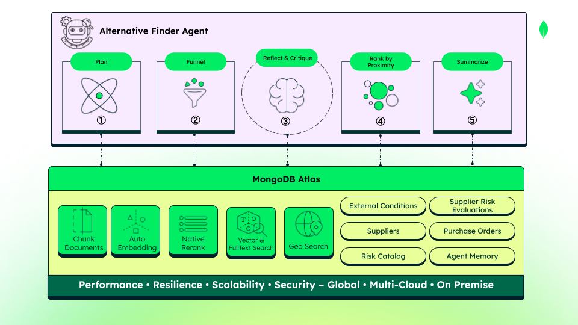

# `alternative_finder`

## What we're demonstrating

Once `risk_evaluator` flags a supplier as CRITICAL, a name alone isn't enough — a procurement manager needs a replacement they can actually trust, backed by real evidence: is this candidate certified, do they have capacity, has anything gone wrong with them before. Finding that fast, across an entire supplier documents corpus, is exactly the kind of thing that stalls when vector search, full-text search, and geospatial ranking live in three different systems.



**① `plan_node`**
- **What it does:** reads the referenced risk evaluation and the disrupted supplier's active orders, then makes one LLM call to synthesize a search plan.
- **Objective:** turn "this supplier is disrupted" into a concrete search brief — which regions to exclude, which evidence types matter, what an ideal replacement looks like.
- **MongoDB's role:** three reads happen before the LLM ever starts, so it never begins from a blank prompt. First, `find_one` on `supplier_risk_evaluations` by `evaluation_id` — if it doesn't resolve, the node raises rather than falling through to a guess. Then a `find` with `$in` on `risk_catalog` to resolve each risk code (like `RISK-LOG-001`) into a real risk type and its `applies_to_regions` — the exclusion list comes from catalog data, not a guess. Then a `find` on `purchase_orders` filtered to `status: "active"` to distill real time pressure (`days_until_due`, `value_usd`, `promotional_window`). Only then does one structured LLM call run — no tools, no loop — and its `doc_type_hint` output is constrained to the real `doc_type` vocabulary, so the plan can only name values the next step can actually filter on.
- **Collections:** reads `supplier_risk_evaluations`, `risk_catalog`, `purchase_orders`.

**② `funnel_node`**
- **What it does:** narrows the whole supplier universe down to five candidates using a pre-filter, hybrid search, and native reranking.
- **Objective:** hand the expensive reasoning step a short, high-quality shortlist instead of the entire corpus.
- **MongoDB's role:** fully deterministic — no LLM call at all. A plain `find` builds the candidate pool over `suppliers` (active, matching product category, excluding the disrupted region and the disrupted supplier itself). Then hybrid retrieval over `supplier_documents` — each certificate, contract, or audit excerpt lives as one chunk document holding `chunk_text`, its own `auto_embed_text`, `doc_type`, and `valid_until` all together, so the evidence, its search vector, and its expiry date sit in one place, with no separate file store and no separate vector database. A single `$rankFusion` aggregation combines a `$vectorSearch` arm (on `auto_embed_text`, biased toward step ①'s `doc_type_hint`) and a `$search` arm (full-text, on `chunk_text`) — weighted 70% vector / 30% text. Native Voyage reranking (`$rerank`, model `rerank-2.5`) then runs as a further stage in an aggregation pipeline — never an external API call. Native `$rerank` rollout can vary by environment, which is expected for a Preview capability, so `funnel_node` wraps this step in a resilience fallback (native → external Voyage API → unranked fused order) and reports which tier actually ran; the pipeline keeps working regardless. One real inefficiency worth flagging: the fusion aggregation runs twice per request — once to size the candidate pool, again inside the rerank pipeline — so the fusion work itself gets paid for twice.
- **Collections:** reads `suppliers`, `supplier_documents` (`$rankFusion` + `$rerank`).

**③ `reflect_critique_node`**
- **What it does:** for each candidate, drafts cited claims against the audit criteria, then verifies them in a separate, adversarial pass — the Reflect & Critique pattern.
- **Objective:** make sure every positive claim about a candidate traces back to a real document chunk, and that an honest "unknown" survives instead of getting papered over. This is the one step in the pipeline where an unverified claim would actually reach a person's decision — a manager approving a replacement supplier on the strength of it — so it's the one step where a single self-graded LLM pass isn't good enough.
- **MongoDB's role:** Generate and Audit are two separate LLM calls per candidate, not one. Splitting them is the point of the pattern, not an implementation detail: a call that drafts a claim and immediately grades its own claim shares the same blind spot that produced it in the first place. A second call, with no memory of having just made the case, is what makes the audit genuinely adversarial instead of a formality — it has to independently confirm the citation is real, still valid, and actually says what was claimed. Between the two sits gap resolution — a single targeted lookup, not a loop: if the gap survives that one attempt, the criterion honestly stays "unknown." Retrieval here is scoped per-supplier, over the corpus reranking already narrowed — never the full set again. Two independent precedent searches run against `agent_memory` and stay separate objects, never merged into one score: an exact per-candidate track record (a `find` on `episode.resolution.alt_supplier_id`) and a semantic precedent (`$vectorSearch` on `auto_embed_text`, filtered by `risk_type`, with **no supplier filter** — computed once per run, then attached identically to every candidate, since it describes the risk situation rather than any one candidate specifically). Deterministic guardrails then override the model where it matters: a citation that doesn't exist in the real chunk data forces the verdict to "unknown"; a citation past its `valid_until` forces "noncompliant."
- **Collections:** reads `supplier_documents` (per-candidate, plus at most one gap lookup), `agent_memory` (`find` + `$vectorSearch`).

**④ `rank_assembly_node`**
- **What it does:** measures each surviving candidate's distance to the distribution center and applies the ranking rule.
- **Objective:** make position an explicit, defensible number, not an implied order.
- **MongoDB's role:** deterministic, no LLM. A single `$geoNear` on `suppliers`, scoped only to the candidates that survived the audit — it never re-touches the full corpus. A candidate with no usable location simply gets `proximity_km: null`, a real data gap rather than an invented number, and it can never win a proximity tiebreak. One honest caveat baked into the code itself: the reference distribution-center coordinate is a documented assumption (no real DC coordinate exists in the system yet), and that assumption travels downstream as an explicit flag, so nothing downstream mistakes it for a verified fact.
- **Collections:** reads `suppliers` (`$geoNear`).

**⑤ `summarize_node` → `persist_node`**
- **What it does:** writes a plain-text rationale and glossary for each candidate, then inserts the finished shortlist as a new run document and closes the stream.
- **Objective:** make the shortlist readable to a manager, and preserve every run as auditable history — in one move.
- **MongoDB's role:** `summarize_node` itself makes one LLM call per candidate with no MongoDB access at all — every input is already sitting in state, produced by the earlier steps' MongoDB work: rank, proximity from `$geoNear`, evidence coverage from the audit. Glossary definitions aren't generated by the model — it only names which terms it used, and the actual wording comes verbatim from a fixed internal dictionary. A parse failure falls back to a safe, deterministic one-liner rather than crashing the stream. `persist_node` then runs the module's only write: a single `insert_one` into `supplier_alternatives` — never an upsert, so every run's history survives alongside the baseline document. The document makes the same case for the document model that `supplier_risk_evaluations` does: tightly structured fields (integer `rank`, `proximity_km`, nested citation objects with `chunk_id`/`page`/`valid_until`) sit side by side with free-form LLM prose (`rationale`) and a variable-length `glossary` array — no join, no separate text table. `approved_supplier_id` is always `null` by design; only a human reviewer sets it.
- **Collections:** writes `supplier_alternatives`.
- **Data stored:** one `supplier_alternatives` document per run — the full ranked shortlist, with citations, precedent, and rationale.

---

**Why MongoDB matters in the agentic world:** what this pipeline is, underneath the node names, is a small but real instance of a **context layer** — not a vector database bolted onto an agent, but the system that decides what evidence is even worth a token before the model ever sees it. The working rule inside it is the same one any serious context layer needs: a handful of candidates can be handed to a model wholesale, but a whole document corpus needs deterministic narrowing first — serializing hundreds of chunks into a prompt is expensive and mostly useless. That's why `$rankFusion` and native reranking run entirely inside Layer 1, with zero LLM calls, before `reflect_critique_node` ever drafts a claim. And because none of that lives in separate infrastructure, security isn't bolted on after the fact: the same role-based access controls and the same encryption regime that protect a contract's text protect its vector index too, because it's the same document — not two systems with two permission models to keep in sync as the corpus grows. That last part is also what lets this scale without a re-architecture: adding more suppliers, more documents, or more risk types means more data in the same collections, on the same platform, not a second system to stand up and keep consistent with the first.

---

## MongoDB capabilities used by this module

1. [`$rankFusion`](https://www.mongodb.com/resources/products/capabilities/hybrid-search) — hybrid search in `funnel_node`, combining a `$vectorSearch` arm and a `$search` arm into one fused, ranked result.
2. [Native `$rerank`](https://www.mongodb.com/docs/vector-search/hybrid-search/vector-search-with-full-text-search/) — Voyage's reranking model running as a further aggregation stage in the same pipeline; candidates are never pulled out to an external API.

   > **Note:** Native `$rerank` rollout can vary by environment. This project includes a resilience fallback (native → external Voyage API → unranked fused order) so the pipeline keeps working regardless.

3. [`$vectorSearch`](https://www.mongodb.com/docs/atlas/atlas-vector-search/vector-search-overview/) — the vector arm of the hybrid search over `supplier_documents`, plus a separate cross-supplier precedent search over `agent_memory` in `reflect_critique_node`.
4. [`$search`](https://www.mongodb.com/docs/atlas/atlas-search/) — full-text search on `supplier_documents.chunk_text`, the lexical arm of the hybrid search. Confirmed to appear in exactly this one place — no other node uses it.
5. [Atlas Auto-Embedding](https://www.mongodb.com/docs/vector-search/crud-embeddings/automated-embedding/) — confirmed identical to `risk_evaluator`: both `supplier_documents` and `agent_memory` declare `auto_embed_text` and pass a plain text query; Atlas generates and maintains the embedding, no client-side vector computed anywhere in this module.
6. [`$geoNear`](https://www.mongodb.com/docs/manual/reference/operator/aggregation/geoNear/) — proximity ranking in `rank_assembly_node`, scoped only to candidates that survived the audit.
7. [2dsphere index](https://www.mongodb.com/docs/manual/core/indexes/index-types/index-geospatial/) — on `suppliers.location`, required for `$geoNear` to run.
8. [Compound index](https://www.mongodb.com/docs/manual/core/index-compound/) — `supplier_id` + `doc_type` on `supplier_documents`, keeping the per-candidate chunk fetch inside `reflect_critique_node` fast as the corpus grows.


---

## 2. Anatomy of a `supplier_alternatives` document

```json
{
  "evaluation_id_ref": "EVAL-2026-0441-A",
  "session_id": "sess-abc123",
  "blocked_supplier_id": "SUP-SHENZHEN-441",
  "is_base": false,
  "is_demo_trigger": false,
  "status": "pending_approval",
  "risk_types": ["geopolitical_tariff"],
  "reference_point": {
    "type": "Point",
    "coordinates": [-118.2, 34.0],
    "assumed": true
  },
  "candidates_evaluated": 5,
  "candidates_discarded": 0,
  "candidates": [
    {
      "supplier_id": "SUP-MONTERREY-MX",
      "supplier_name": "Monterrey Rigid Packaging S.A.",
      "location": "Mexico",
      "category": "packaging_materials",
      "proximity_km": 2140.5,
      "evidence_coverage": { "criteria_total": 3, "criteria_verified": 3 },
      "precedent_summary": "none",
      "criteria": [
        {
          "criterion": "certification_valid",
          "status": "compliant",
          "citation": {
            "chunk_id": "CHK-MTY-CERT-004",
            "doc_type": "certificate",
            "source_file": "iso9001_2025.pdf",
            "page": 1,
            "excerpt": "ISO 9001:2015 — scope: rigid and flexible packaging manufacturing...",
            "valid_until": "2027-03-01"
          }
        }
      ],
      "rank": 1,
      "rationale": "Monterrey Rigid Packaging holds a current ISO 9001:2015 certification covering the required scope, with no prior track record on file and no directly comparable precedent found.",
      "glossary": [
        { "term": "ISO 9001:2015", "definition": "An international quality-management certification standard." }
      ]
    }
  ],
  "discarded_candidates": [],
  "approved_supplier_id": null,
  "decision_deadline": null,
  "created_at": "2026-06-14T10:22:00Z"
}
```

`reference_point.assumed: true` is the honest flag from `rank_assembly_node` — there's no real distribution-center coordinate in the system yet, so nothing downstream can mistake this for verified data. `candidates_discarded` and `discarded_candidates` are always `0` / `[]` — the funnel and rerank cutoff mean nothing is ever recorded as an explicit rejection. `precedent_summary` collapses the two independent precedent checks (exact track record + semantic) into one string for the persisted document; the full, unmerged objects are only available over the live SSE stream.

---

## 3. Endpoint

**`POST /api/alternative-finder/find`**

```json
{ "evaluation_id_ref": "EVAL-..." }
```

- **Headers:** `X-Session-ID` required. Confirmed real behavior: **422** if the header is missing entirely, **400** only if present but empty.
- **Response:** Server-Sent Events, framed on an `event` key inside an envelope (`event`, `layer`, `timestamp`, `session_id`) — a different shape from `risk_evaluator`'s `type`-keyed contract. Terminal event `shortlist_ready` carries the persisted shortlist.
- **Guarantees:** one `supplier_alternatives` document per run, `approved_supplier_id: null` until a human sets it.

```bash
curl -N -X POST http://localhost:8000/api/alternative-finder/find \
  -H "X-Session-ID: demo-session-123" \
  -H "Content-Type: application/json" \
  -d '{"evaluation_id_ref": "EVAL-2026-0441-A"}'
```

---

## Related

- [ADR-005](../../docs/adr/005-backend-operational-data-layer.md) — Operational Data Layer (how this module couples to the others, purely via data)
- [ADR-006](../../docs/adr/006-backend-context-engineered-four-layer-architecture.md) — Context-Engineered Four-Layer Architecture (the conceptual layers; the real graph has six nodes across them)
- [ADR-007](../../docs/adr/007-backend-native_reranking.md) — Native In-Pipeline Reranking
- [ADR-008](../../docs/adr/008-backend-precedent_signals_no_fusion.md) — Two Separate Precedent Signals (why exact and semantic precedent are never fused into one score)
- [ADR-009](../../docs/adr/009-backend-agent_memory_single_writer.md) — `agent_memory`: precedent reads now, closure-loop write deferred by design (this module never writes to `agent_memory`)
