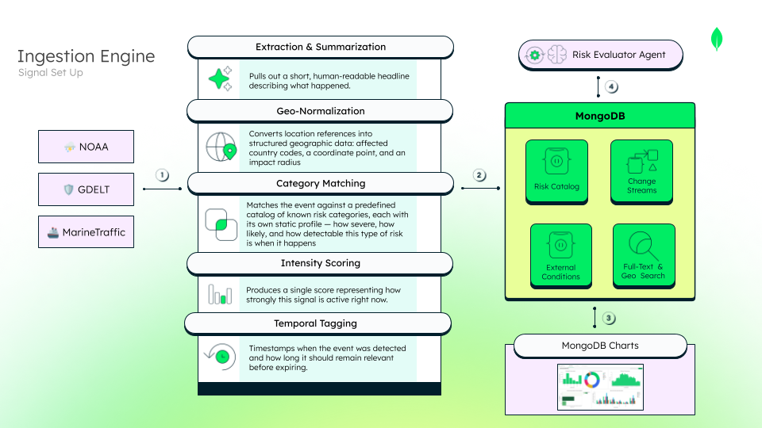
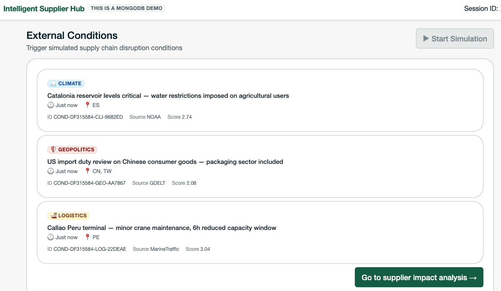

# `ingestion_engine` — deterministic scenario generator

## What we're demonstrating



This is where the system turns the outside world into something it can reason
about. The signals come from real-world data sources, each covering a
different risk category:

* **NOAA** (National Oceanic and Atmospheric Administration) — U.S.
  government weather and climate data: droughts, storms, temperature
  anomalies.
* **GDELT** (Global Database of Events, Language and Tone) — a global
  monitor of news coverage across 65 languages, used here to detect
  geopolitical events, trade disputes, and regulatory shifts as they're
  reported.
* **MarineTraffic** — real-time vessel tracking and port activity data (via
  AIS signals), used to detect shipping delays, port congestion, and
  logistics disruptions.

**① Raw signal in.** A scheduled poller would connect to each source's API,
pulling in whatever format each one returns. These sources don't arrive as
clean data — they arrive as headlines, coordinates, port status reports.

**② Normalization, powered by MongoDB.** The Ingestion Engine takes that raw
signal and runs it through the same discipline a risk management team
already uses: classify it against known risk categories, locate exactly who
it affects, and score how strongly it's active right now — turning a
real-world event into a number the rest of the system can act on. MongoDB
Atlas makes each step possible without bolting together separate tools:

* **Geo Search** — normalizes the signal's location into a queryable point
  and radius, so a downstream evaluation step can later answer "who is
  physically in the path of this event."
* **Full-Text Search** — classifies the raw signal against the risk catalog
  by matching exact terms, regulatory acronyms, and category keywords (e.g.
  "OFAC," "CBAM," "port congestion") straight from the headline.
* **Flexibility** — not every signal looks the same. A port congestion event
  carries coordinates and an impact radius; a tariff or sanctions signal has
  no physical location at all. MongoDB's document model adapts to each one
  without forcing a rigid, one-size-fits-all schema. This is what lets the
  Ingestion Engine read the static risk profile from `risk_catalog` and
  write the newly scored signal to `external_conditions` in whatever shape
  it needs — every signal, however messy or varied, gets translated into
  the same ready-to-use language the rest of the system speaks.

**③ Ready to visualize.** Once normalized, the signal is immediately
queryable — MongoDB Charts can read directly off the same live collection,
no separate ETL step or data pipeline needed to turn a fresh signal into a
dashboard update.

**④ Triggering the next agent.** In a fully live system, the write itself
would be the trigger: a Change Stream on `external_conditions` could notify
`risk_evaluator` the instant a new signal lands — no polling, no scheduler,
no message queue in between.

**Why MongoDB:** one platform covers geolocation, search, real-time
reactivity, and flexible schema together — the alternative would be
stitching together separate specialized tools just to get a single signal
ready to use, let alone reacted to and visualized.

*In this demo, the Ingestion Engine doesn't call these external APIs live —
it generates deterministic, pre-calibrated signals using the same MongoDB
document model shown above, so every demo session produces a consistent,
reliable risk scenario to build the story around. Exactly how it does that,
grounded in the real code, is what the rest of this document explains.*


## 1. How this module works




`ingestion_engine` seeds each demo session with up to **3 signals** — one per
risk type (`geopolitical_tariff`, `logistics_disruption`,
`climate_disruption`) — by selecting a `(supplier, risk)` pair for each type
and inserting a corresponding document into `external_conditions`. It is the
first step of the demo flow: it plants the signals that `risk_evaluator`
will later read and score, and that `alternative_finder` will ultimately
react to.

**It is not an agent.** There is no LangGraph graph, no LLM call, and no
reasoning loop anywhere in this module — the whole module is four files
(`router.py`, `service.py`, `target_selector.py`, `signal_generator.py`) of
plain async Python and MongoDB queries. The only non-determinism is
`random.shuffle` / `random.choice` when choosing which supplier, which risk,
and which base signal to use.

**Why one per risk type, and why generated instead of scripted:** a demo
needs a scenario that is realistic *and* reproducible. Every session must
land on at least one supplier whose dynamic RPN crosses its
`alert_threshold_rpn`, otherwise the downstream agents have nothing
interesting to show. Rather than hand-crafting a fixture, this module
derives the signal magnitude from live catalog data at run time, so the
scenario stays consistent with whatever is currently in the database.

**What it is not trying to be:** a neutral, live simulation of the real
world. It does not model actual events, probabilities, or an unbiased
distribution of outcomes. It works *backwards* from the alert threshold to
guarantee an alert.

### 1.1 The seed strategy — where the raw material comes from

Each of the 3 signals generated per session is a **copy of a randomly chosen
`is_base: true` template** already sitting in `external_conditions`, for the specific `risk_catalog_ref` selected. Nothing is
generated from scratch — the module picks an existing template and
recalibrates only what needs to be session-specific. If no base
template exists for a selected `risk_catalog_ref`, generation fails loudly
(`SignalGenerationError`) rather than inventing one.

### 1.2 Target selection — `target_selector.py`

`select_targets(db)` produces **up to one `(supplier, risk)` pair per risk
type**. The logic:

1. Read `suppliers` with the pre-filter `{"has_active_orders": True}` —
   suppliers without active orders are **never selectable**.
2. `random.shuffle` the resulting list.
3. Walk the shuffled suppliers. For each one, query `risk_catalog` for
   entries where `applies_to_regions` contains the supplier's `region` **and**
   whose `risk_type` is one of the types not yet covered.
4. `random.choice` one of the matching risks, record the pair, mark that
   `risk_type` as covered, and stop once all three types are covered.

A supplier can appear at most once per session, each risk type appears at
most once, and region coverage in `risk_catalog.applies_to_regions` is what
ultimately decides which suppliers are reachable.

### 1.3 The `condition_score` formula — `signal_generator.py`

```python
condition_score = (
    risk["alert_threshold_rpn"]
    / (risk["severity"] * risk["occurrence_base"] * worst_case_weight * risk["detection"])
) * SAFETY_MARGIN          # SAFETY_MARGIN = 1.15
```

| Variable | Where it comes from | What it is |
|---|---|---|
| `alert_threshold_rpn` | selected `risk_catalog` document | RPN value at or above which `risk_evaluator` raises an alert |
| `severity` | same document | FMEA severity factor |
| `occurrence_base` | same document | FMEA baseline occurrence factor |
| `detection` | same document | FMEA detectability factor |
| `worst_case_weight` | computed from `agent_memory` — see §1.4 | worst-case historical multiplier |
| `SAFETY_MARGIN` | module constant, `1.15` | fixed 15% headroom above threshold |

This is the FMEA formula solved backwards for the signal magnitude:
`risk_evaluator` computes `rpn_dynamic = severity × (occurrence_base ×
condition_score) × detection`, so dividing the threshold by the other three
factors yields precisely the `condition_score` that lands *on* the
threshold — `× 1.15` puts it 15% above.

**This is intentional reverse-engineering, not a model of real-world
severity.** It's a deliberate design decision for demo reliability, not
production logic — read before reusing this formula elsewhere. Two honest
caveats:

- The 15% margin is **not arithmetically guaranteed** to survive
  `risk_evaluator`'s `distance_decay`, which can multiply `rpn_dynamic` by as
  little as `0.70` for physical signals far from the epicentre. For those,
  the alert is likely, not certain.
- The live graph derives its own `historical_weight` via an LLM ReAct loop
  (`reason_and_retrieve`), which can return any float. The deterministic
  `1.20`/`0.90` rule this module mirrors (§1.4) lives in a separate function,
  `retrieve_memory`, which is **not wired into the current graph** — so this
  module's worst-case weight defends against a rule that is currently
  dormant downstream.

### 1.4 `historical_weight` — `_worst_case_historical_weight`

A plain, **read-only** `find` on `agent_memory`, filtered by `risk_type`
only (cross-supplier — `ingestion_engine` never writes to `agent_memory`).
Per matching episode, a weight is derived from
`episode.actual_impact.occurred`: `1.20` if `True`, `0.90` if `False`. The
**minimum** across matches is taken, then clamped with `min(1.0, …)` — an
amplifying episode can only get clamped back to neutral, never used to
shrink the demo's safety margin. No match → neutral default `1.0`.

---

## 2. Why the document model matters here

Not every signal this module writes looks the same. A port congestion
template carries `epicentre` and `impact_radius_km`; a tariff or sanctions
template has no physical location at all — `has_physical_location: false`
and both fields simply absent. There's no Pydantic model enforcing a fixed
shape on `external_conditions`: every field not explicitly overridden is
inherited verbatim from whichever base template was copied. That's what lets
one collection hold genuinely different signal shapes side by side, and
what lets this module stay indifferent to *which* shape it's copying — it
only needs to know which fields it must override, not the full shape of
every possible signal.

---

## 3. Anatomy of an `external_conditions` document

Here's a real `is_base: true` template from the seed data — this is exactly
what one of the 206 base signals looks like before `ingestion_engine` ever
touches it:

```json
{
  "_id": {
    "$oid": "6a3a8dcfaa8e334aa469a3d9"
  },
  "condition_id": "COND-BASE-CLM-010",
  "risk_catalog_ref": "RISK-CLM-001",
  "risk_type_triggered": "climate_disruption",
  "source": "NOAA",
  "raw_headline": "Chiapas-Oaxaca border — heavy rainfall advisory, river levels above seasonal average",
  "affected_regions": [
    "MX"
  ],
  "condition_score": 0.18,
  "has_physical_location": true,
  "epicentre": {
    "type": "Point",
    "coordinates": [
      -93.1,
      16.8
    ]
  },
  "impact_radius_km": 90,
  "detected_at": {
    "$date": "2026-06-14T06:00:00.000Z"
  },
  "valid_until": null,
  "is_base": true,
  "is_demo_trigger": false,
  "session_id": null
}
```

Walking through it: `condition_id` and `risk_catalog_ref` identify this
signal and which `risk_catalog` entry it instantiates (`RISK-CLM-001`, a
climate risk). `risk_type_triggered` and `source` say what kind of risk this
is and which notional feed it claims to come from — here, NOAA. `raw_headline`
and `affected_regions` are the human-readable description and the region
codes used to match suppliers when there's no coordinate. `condition_score`
is the signal's calibrated intensity — in this seed, `0.18`, though
`ingestion_engine` overrides this value at generation time (§1.3), so the
seed's number is irrelevant once a session runs.

`has_physical_location: true` means this signal carries real coordinates:
`epicentre` (a GeoJSON `Point`) and `impact_radius_km` (`90` here) together
define the area `risk_evaluator` checks suppliers against. A non-physical
signal — a tariff or sanctions risk, say — would have
`has_physical_location: false` and simply omit both fields; `affected_regions`
is what carries the matching logic instead.

`detected_at` is when the signal was recorded; `is_base: true`,
`is_demo_trigger: false` and `session_id: null` mark this specifically as a
**template**, not a generated demo signal. When `ingestion_engine` selects
this template for a session, it strips `_id`, keeps every other field
exactly as shown, and overrides only: `condition_id` (new generated ID),
`condition_score` (recalibrated per §1.3), `detected_at` (current time),
`is_base` (→ `false`), `is_demo_trigger` (→ `true`), and `session_id` (this
request's session).

**`is_base`, `is_demo_trigger` and `session_id` are demo control metadata —
not business meaning.** They say nothing about the risk itself; they exist
so the system can tell seed templates from generated signals and scope
generated signals to one session.

### `valid_until` — what it's for, and how it would work with a TTL index

`valid_until` is meant to answer "when does this signal stop being relevant?"
— in this seed, and in every document this module generates, it's always
`null`: no expiry is modeled today. If it were populated with a real
expiration timestamp, the natural way to enforce it in MongoDB is a **TTL
(Time-To-Live) index**, which automatically deletes a document once its
date field's value has passed — no cron job, no manual cleanup, handled
entirely in the background by the database itself.

To configure it (once `valid_until` actually holds a date instead of `null`):

```javascript
db.external_conditions.createIndex(
  { "valid_until": 1 },
  { expireAfterSeconds: 0 }
)
```

With `expireAfterSeconds: 0`, MongoDB deletes the document at the exact
moment `valid_until`'s value has passed, rather than N seconds after some
other timestamp — which fits this field's meaning (an absolute expiry date)
better than a fixed duration would. Official reference:
**https://www.mongodb.com/docs/manual/core/index-ttl/**

---

## 4. Who reads this

`{"session_id": ..., "is_demo_trigger": True}` is exactly the filter
`risk_evaluator.detect_conditions` uses to pick up what this module wrote —
the shared collection, not a function call, is the hand-off between the two
modules.

### Collections touched by this module

| Op | Collection | Filter / query |
|---|---|---|
| READ | `suppliers` | `{"has_active_orders": true}` |
| READ | `risk_catalog` | `{"applies_to_regions": {"$in": [region]}, "risk_type": {"$in": <remaining types>}}` |
| READ | `agent_memory` | `{"risk_type": <type>}` — plain `find`, read-only |
| READ | `external_conditions` | `{"is_base": true, "risk_catalog_ref": <risk_id>}` |
| **WRITE** | `external_conditions` | `insert_many(<up to 3 docs>)` |

Only equality and `$in` queries — no vector search, geospatial operators, or
aggregation pipelines in this module.

---

## 5. Endpoint

**`POST /api/simulation/start`**

- **Headers:** `X-Session-ID` required. Missing/empty/whitespace-only → HTTP
  400.
- **Request body:** none — session id is the only input.
- **Response:** plain JSON — `{"session_id": "<id>", "signals": [<inserted
  docs, _id stripped>]}`.
- **Guarantees:** 0–3 signals, at most one per risk type, all-or-nothing
  insert (a single `insert_many` runs only after every score is computed).
- **Errors:** a target with no matching `is_base` signal raises
  `SignalGenerationError` (HTTP 500) before anything is written.

```bash
curl -X POST http://localhost:8000/api/simulation/start \
  -H "X-Session-ID: demo-session-123"
```

---

## 6. About the Change Stream mentioned above (④)

Step ④ in the introduction describes the theoretical real-time hand-off.
**That mechanism does not live in this module.** The relevant stub is
`backend/risk_evaluator/stream_listener.py` — a `watch_external_conditions`
function whose body is `pass`, explicitly marked `NOT USED IN THE DEMO`, and
confirmed genuinely unreferenced anywhere in the repo. It's kept as a design
reference for how `risk_evaluator` would react to a live write, documented
further in `docs/adr/003-backend-sse-change-stream.md`.

This module's only real-time contract is the one described in §5: generation
happens synchronously, on an explicit `POST`, and downstream evaluation is
likewise triggered by an explicit frontend call — not by a live feed.