# Intelligent Supplier Hub – User Guide

This guide walks you through the Intelligent Supplier Hub demo step by step. It covers every section of the UI, what each element does, and what MongoDB capability it demonstrates — so you can navigate the demo confidently and understand what is happening at each stage.

---

## Overview

The **Intelligent Supplier Hub** is an AI-powered supplier management portal built for a large grocery superstore retailer. The primary user is a **Supply Chain Manager** — responsible for maintaining supplier continuity and product availability across the retailer's distribution network.
 
The demo walks through a realistic disruption scenario: external conditions arrive simultaneously (a geopolitical instability, a logistical challenge and a climate disruption), an AI agent identifies which suppliers are at risk, and the manager finds and approves a qualified alternative — all from a single interface.
 
When you open the demo you will see a single-page application with three main areas:
 
- A **navbar** at the top
- A **stepper** below the navbar showing the three phases of the demo
- A **content area** that changes depending on which step you are on

The demo follows a linear narrative across three steps. Each step unlocks automatically as you progress — you cannot jump ahead to a step you have not reached yet, but you can always navigate back to a previous step by clicking it in the stepper.

---

## Navigation

### Navbar

The navbar is always visible at the top of the page. It shows the name of the application on the left and a **Session ID** on the right for the current demo session.

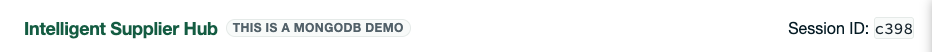

### Stepper

The stepper sits below the navbar and shows your position across the three steps:

| Step | Name |
|---|---|
| 1 | External Conditions |
| 2 | Identify Affected Suppliers |
| 3 | Search for Alternative Suppliers |

Steps are grouped into two phases shown by a brace below the step labels:
- **Phase 1** — covers Steps 1 and 2
- **Phase 2** — covers Step 3

Completed steps show a green tick. The active step is highlighted in green. Future steps that have not been reached yet are greyed out and are not clickable.

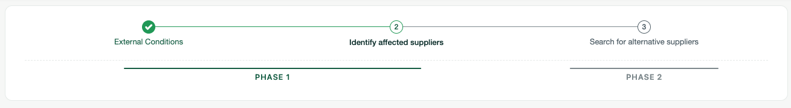

---

## Step 1 · External Conditions

This is the starting point of the demo. It contains three sections: the **External Conditions simulation**, the **Dashboard**, and the **How Alerts Are Generated** card.

---

### External Conditions

This section simulates the arrival of real-time external risk signals into the system.

**How to use it:**

1. Click the **▶ Start Simulation** button in the top right of the section.
2. Three external condition cards appear simultaneously — one for each risk type.

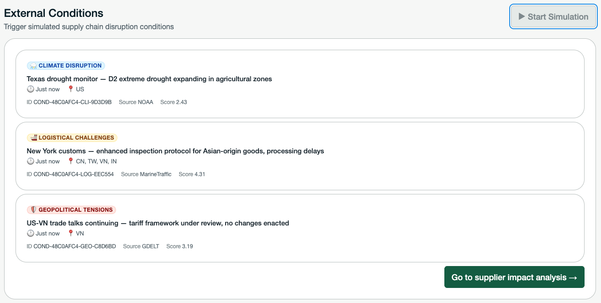

**The three condition types are:**

| Type |
|---|
| 🚢 Logistical Challenges |
| 🛡️ Geopolitical Tensions | 
| ⛈️ Climate Disruption | 

Each card shows the condition title, a short description, and the affected region.

Once all three conditions are visible, a **"Go to supplier impact analysis →"** button appears at the bottom right. Clicking it advances you to Step 2.

> **Demo note:** In this demo, advancing to Step 2 is a manual action to make the workflow easy to follow. In a real production system, the Impact Analyst agent would trigger automatically the moment new external conditions arrive — continuously running in the background without any manual intervention required. The step-by-step structure here is purely for demonstration purposes.

---

### Dashboard

The Dashboard section sits below the External Conditions simulation and displays four embedded **Atlas Charts** visualizations — each pulling live data from the `external_conditions` collection in MongoDB Atlas.

**Clicking Learn More** opens a modal with information about Atlas Charts and links to real customer stories.

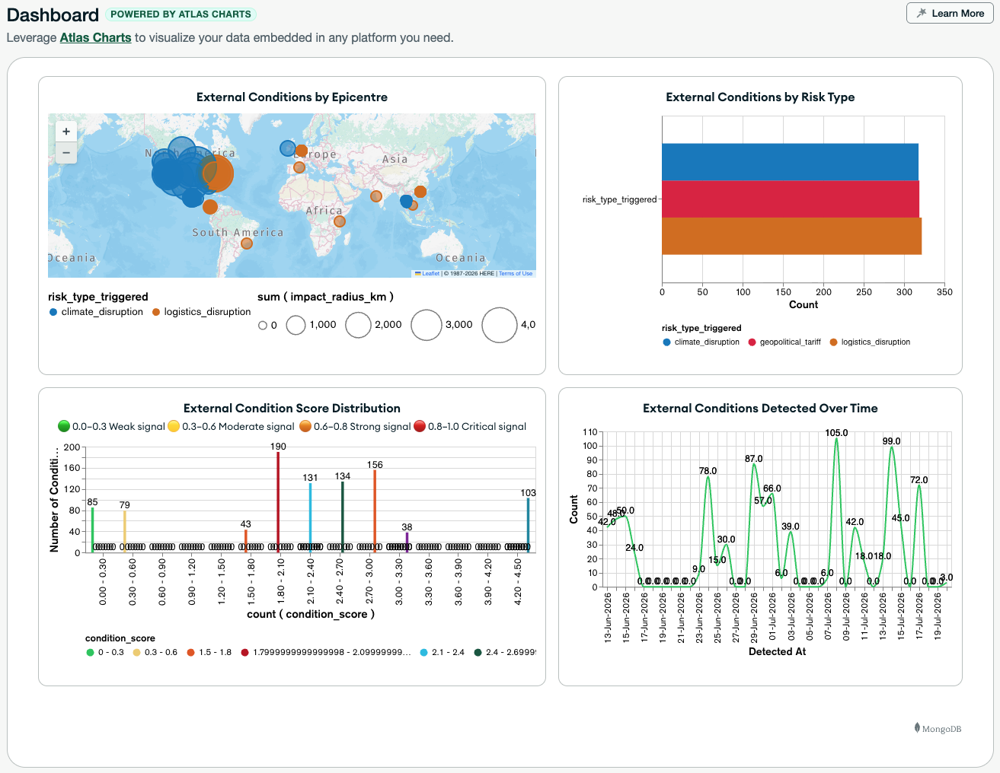

> **MongoDB capability:** All three charts are embedded directly in the application. There is no separate BI tool and no data export — the operational data and the analytics live in the same MongoDB Atlas platform.

---

## Step 2 · Identify Affected Suppliers

You arrive at Step 2 after clicking **"Go to supplier impact analysis →"** at the bottom of Step 1. The content area updates to show the supplier impact analysis workflow.

Step 2 contains three sections: **Supplier Impact Analysis**, **Identifying Affected Suppliers** (the ReAct Agent) and **Affected Suppliers** (the results).

---

### Supplier Impact Analysis

At the top of Step 2 you will see a compact list of the three external conditions that were loaded in Step 1.

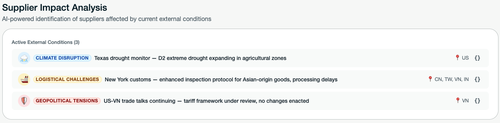

**Clicking the `{}` button** on any condition row opens a modal showing the **MongoDB document model** for that condition. This is the actual document structure stored in the `external_conditions` collection.

---

### Identifying Affected Suppliers — ReAct Agent

This is where the AI agent reasons across all active conditions and determines which suppliers are at risk.

**Agent status:**

| Status | What It Means |
|---|---|
| 🟢 Active (pulsing) | The agent is currently processing |
| ⚫ Idle | The agent has finished and results are ready |

The log steps appear one by one. Each step shows a spinning loader while it is running, which turns into a **green tick** once complete.

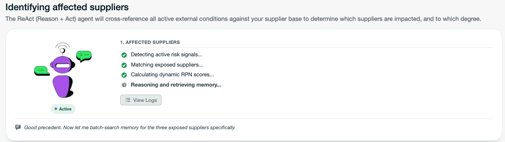

Once the agent is finished identifying affected suppliers and is in Idle state, the **"See full logs →"** button becomes active. Clicking it opens the **Agent Full Logs drawer** from the right side of the screen.

The drawer shows a **log stream** on the right showing the agent's reasoning steps in real time

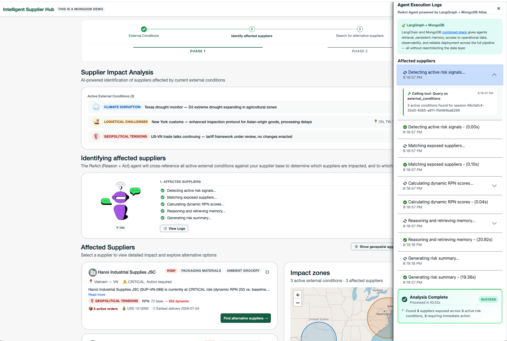

> **MongoDB capability:** The ReAct agent is orchestrated by LangGraph and uses MongoDB as both its retrieval layer (Vector Search) and its memory backend (`langgraph-checkpoint-mongodb` for short-term state, `langgraph-store-mongodb` for long-term episodic memory).

---

### Affected Suppliers

After the agent finishes, a two-column layout appears below the agent section showing the **supplier list** on the left and the **Impact Zone Map** on the right.

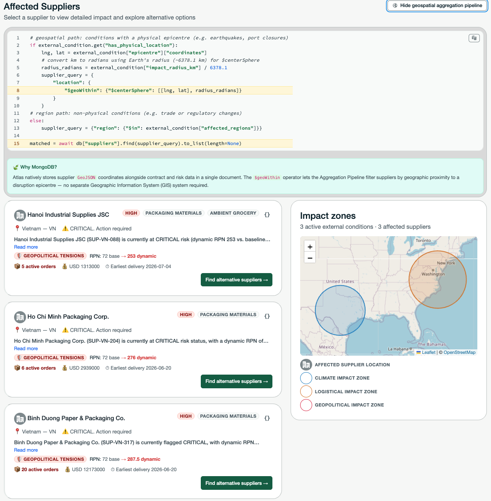

#### Supplier List

The list always shows **affected suppliers**, sorted from most to least critical. 

Each supplier card shows:

- The supplier name, location, and category
- A severity tag (CRITICAL or HIGH) in the top right corner of the card
- **Reason:** a description of why this supplier is affected by the current conditions
- **Affected by:** the specific external condition(s) impacting this supplier, shown as colour-coded badges. Each badge displays the actual condition title (e.g. "Red Sea Corridor Disruption Detected") with the condition type icon. Hovering over a badge shows the condition category name (e.g. "Logistical Challenges").
- Next to each condition badge, the **dynamic RPN** (Risk Priority Number) shows the baseline score and the updated elevated score — for example `RPN: 45 → 168`. This shows how much the agent has adjusted the risk score in the context of the current disruption.

> **Note:** If a supplier is affected by more than one external condition (for example both a logistical and a geopolitical disruption), you will see multiple condition badges with individual RPN values, one per condition.

**CRITICAL affected suppliers** have a **"Find alternative suppliers →"** button at the bottom right of their card. Clicking this advances you to Step 3. **HIGH severity suppliers** do not show this button.

#### Impact Zone Map

The map on the right of the screen shows the geographic context of the disruptions.

**Geofence zones:** each active external condition is represented by a colour-coded dashed polygon on the map, labelled with the affected zone name (e.g. "Red Sea Corridor", "Eastern Europe", "Gulf Coast"). The zones pulse gently to indicate they are live conditions.

**Supplier pins:** each affected supplier is shown as a teardrop pin on the map. Red pins indicate CRITICAL suppliers and amber pins indicate HIGH severity suppliers.

**Interaction:** clicking over a supplier card in the list highlights the corresponding pin on the map — the pin enlarges, pulses, and shows a tooltip with the supplier name. This also works in reverse: hovering a pin on the map highlights the corresponding card.

**Viewing the aggregation pipeline:** above the two-column layout there is a **"View geospatial aggregation pipeline"** link. Clicking it expands a code block showing the MongoDB `$geoWithin` / `$centerSphere` query used to identify suppliers within the impact radius.

Look for the **🍃 Why MongoDB?** callout to learn how MongoDB handles both GeoJSON objects and legacy coordinate pairs natively, without any external GIS tooling.

---

## Step 3 · Search for Alternative Suppliers

You arrive at Step 3 after clicking **"Find alternative suppliers →"** on any CRITICAL supplier card in Step 2. The content area updates to show the alternative sourcing workflow.

Step 3 contains three sections: **Affected Supplier**, **Identifying Alternative Suppliers** (the ReAct Agent) and **Recommended Alternative Suppliers**.

---

### Affected Supplier

This section shows the supplier you selected in Step 2.

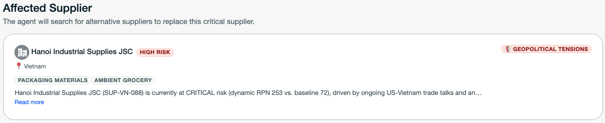

---

### Identifying Alternative Suppliers — ReAct Agent

This section mirrors the agent section from Step 2 but runs a more complex **four-phase retrieval pipeline**.

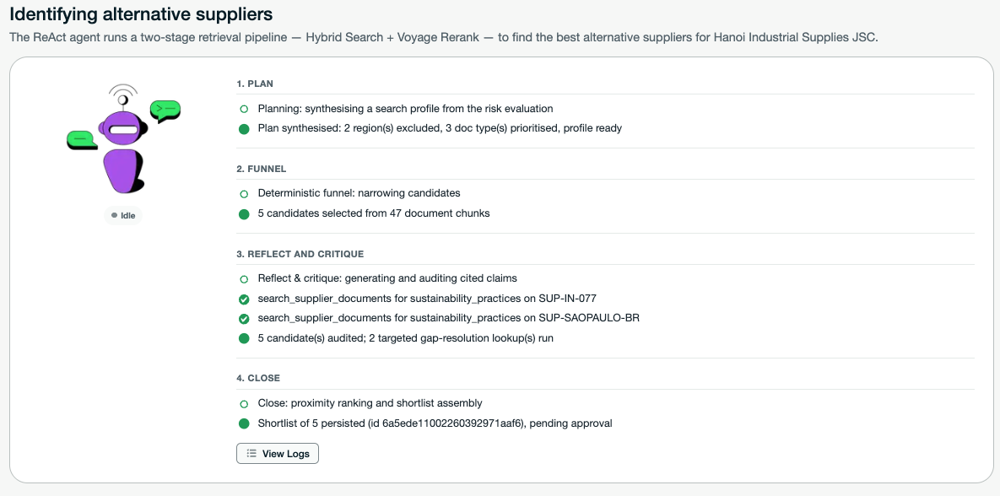

**1. Plan**
The agent synthesises a search profile from the risk evaluation — determining which regions to exclude and which document types to prioritise.
 
**2. Funnel**
The retrieval phase. The agent runs the deterministic narrowing pipeline — filtering suppliers by category and excluded regions, then running Hybrid Search (Vector + Full-Text + RRF) across supplier documents, followed by native Voyage reranking. 
 
**3. Reflect and Critique**
The validation phase. For each of the 5 shortlisted suppliers, the agent reads their documents and audits three criteria: `compliance_certification`, `operational_status`, and `sustainability_practices`. 
 
**4. Close**
The final phase. The agent calculates real spherical proximity from each candidate to the distribution centre and persists the shortlist to MongoDB. You will see a confirmation log (e.g. *"Shortlist of 5 persisted (id ...), pending approval"*).

Once the agent is Idle, the **"See full logs →"** button becomes active.

#### See Full Logs Drawer

The drawer for Step 3 shows the details of every log in each phase. For example for the **Funnel phase** you will see a log confirming how many candidates were selected and from how many document chunks (e.g. *"5 candidates selected from 47 document chunks"*). 

For the **Reflect and Critique phase** logs appear per supplier as they are audited. If a criterion has a gap, the agent runs a targeted follow-up search — you will see those tool calls appear as individual log lines (e.g. *"search_supplier_documents for sustainability_practices on SUP-IN-077"*). The phase ends with a summary line showing how many candidates were audited and how many gap-resolution lookups were run.

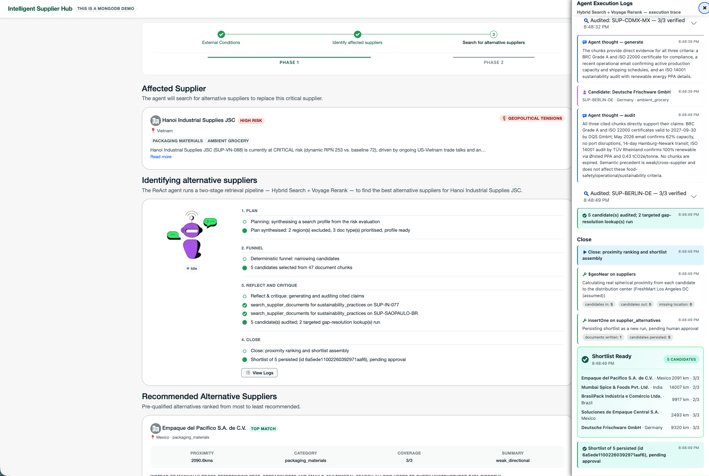

---

### Recommended Alternative Suppliers

After the agent finishes, a list of **5 alternative suppliers** appears, ordered from most to least recommended.

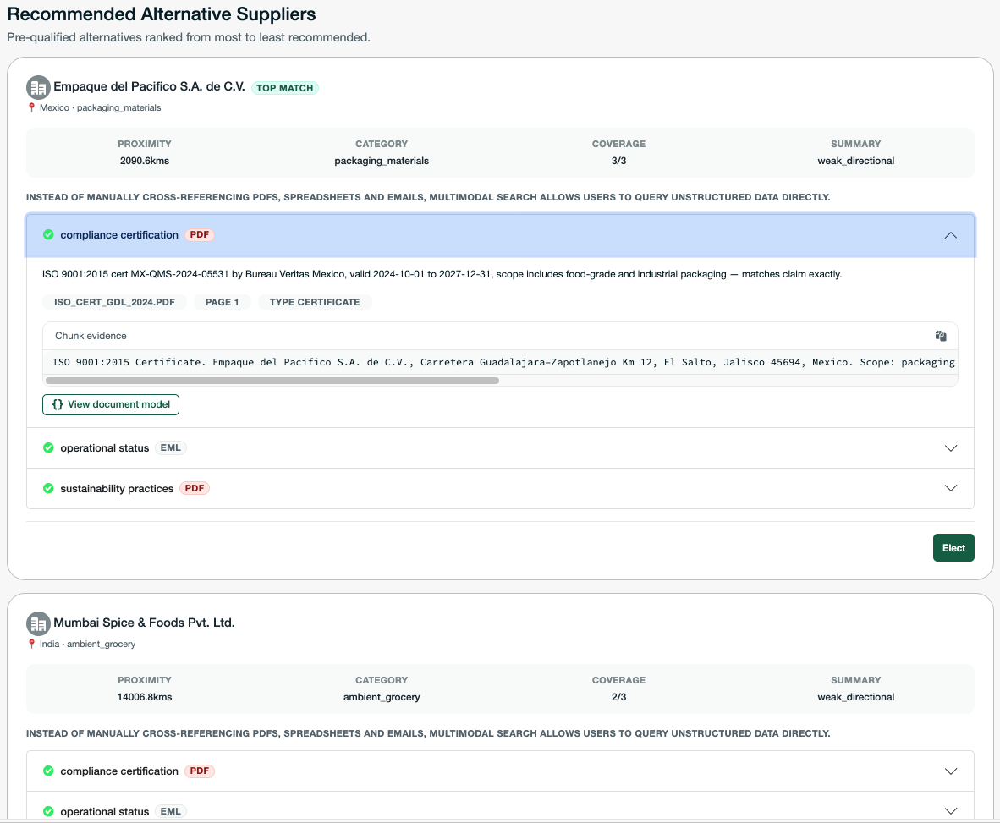

#### Reading an Alternative Supplier Card

| Column | What It Shows |
|---|---|
| **Proximity** | Distance in km from the candidate to the distribution centre, calculated via MongoDB's `$geoNear`. Marked as *assumed* if the DC coordinate is an assumption |
| **Category** | The supplier's product category |
| **Coverage** | How many of the three audit criteria were verified out of three (e.g. `2/3` or `3/3`) |
| **Summary** | The precedent summary — either `exact_track_record` if this supplier was previously approved in a similar disruption, or `weak_directional` / `moderate_directional` if only a cross-supplier semantic match exists from the agent's memory |

**Collapsible validation rows**
 
Three rows that can be expanded individually, one per audit criterion:
 
| Row | What It Validates | Possible Status |
|---|---|---|
| **Compliance Certification** | A valid, non-expired ISO 9001 or equivalent certificate on file | ✅ Compliant · ❌ Non-compliant · ❓ Unknown |
| **Operational Status** | Recent emails or contracts confirming active commercial engagement and current capacity | ✅ Compliant · ❌ Non-compliant · ❓ Unknown |
| **Sustainability Practices** | A sustainability report with verified environmental metrics | ✅ Compliant · ❌ Non-compliant · ❓ Unknown |
 
> **Note on Unknown:** If no relevant document exists on file for a supplier, the criterion shows as ❓ Unknown. The agent does not guess. Sustainability in particular will frequently show as unknown across candidates — this reflects a real gap in available documentation, not a system error.

When you expand any row you will see:
- The source document type badge (e.g. PDF, email), filename, and page number
- An **Extracted Content** label above the exact text chunk the agent used to reach its verdict — including certificate numbers, validity dates, and capacity figures where present
- A **📄 View document model** button that shows the chunk and a preview of the source document for that chunk

<table>
	<tr>
		<td width="50%">
			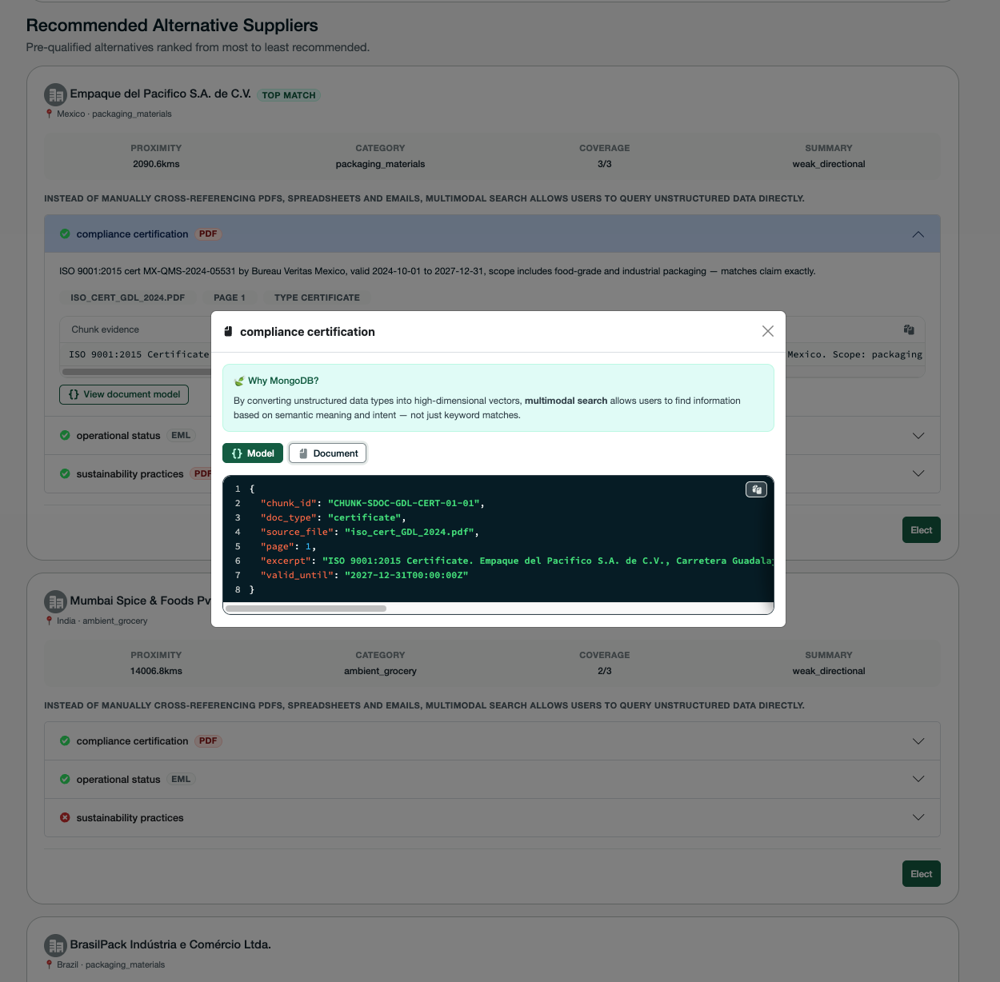
		</td>
		<td width="50%">
			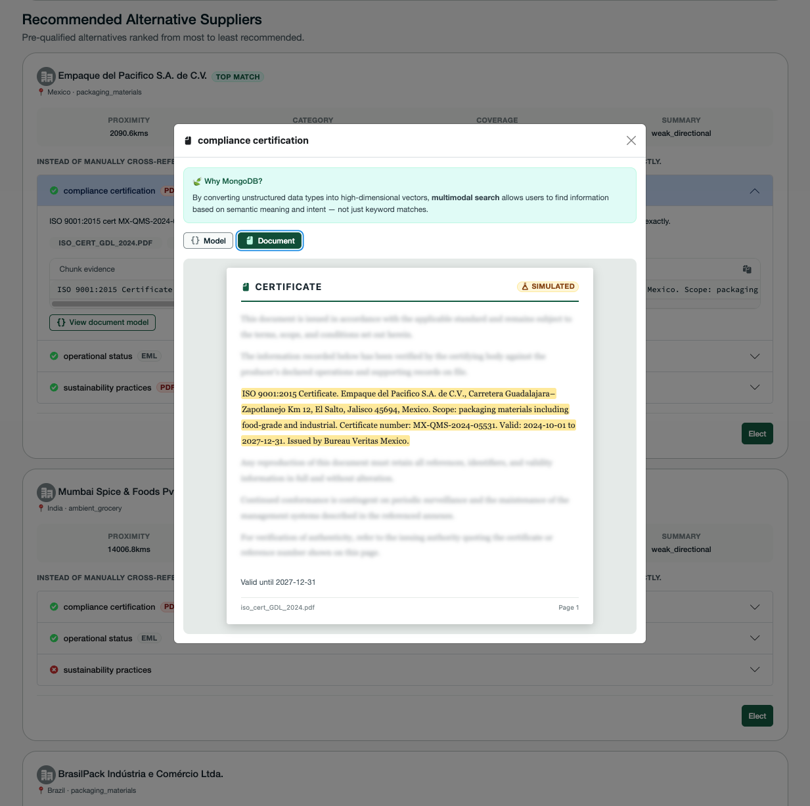
		</td>
	</tr>
</table>

**Escalate button**

At the bottom right of each alternative supplier card is an **Escalate** button.

Clicking Escalate opens a full-page modal with a green header and the title **"Congratulations!"**

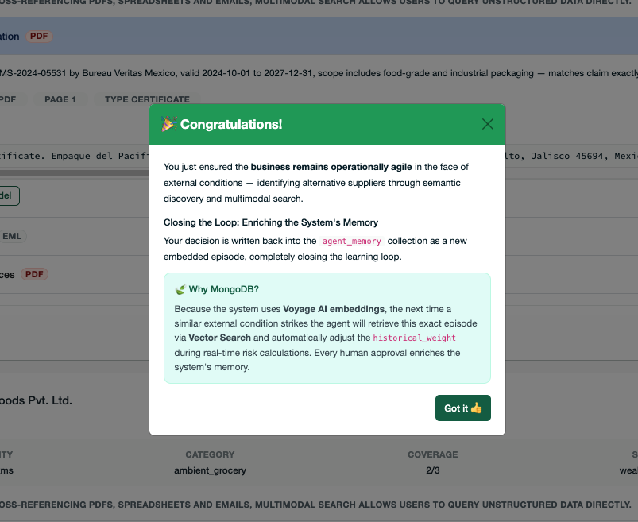

Click **"Got it 👍"** to close the modal. You have now helped ensure that the business stays agile in the face of external conditions that disrupt your supply chain.

---

## Summary

| Step | What You Do | What It Shows |
|---|---|---|
| **Step 1** | Start Simulation, explore the Dashboard | External condition ingestion, Atlas Charts embedding |
| **Step 2** | Review the ReAct agent logs, explore the impact map and supplier cards | Geospatial search, Vector Search, dynamic RPN, LangGraph + MongoDB memory |
| **Step 3** | Review alternative suppliers, expand validation rows, click Escalate | Hybrid Search, Voyage AI reranking, multimodal document search, agent memory write-back |